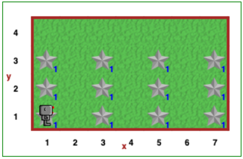
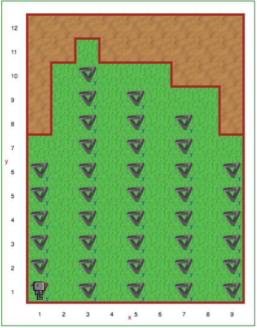
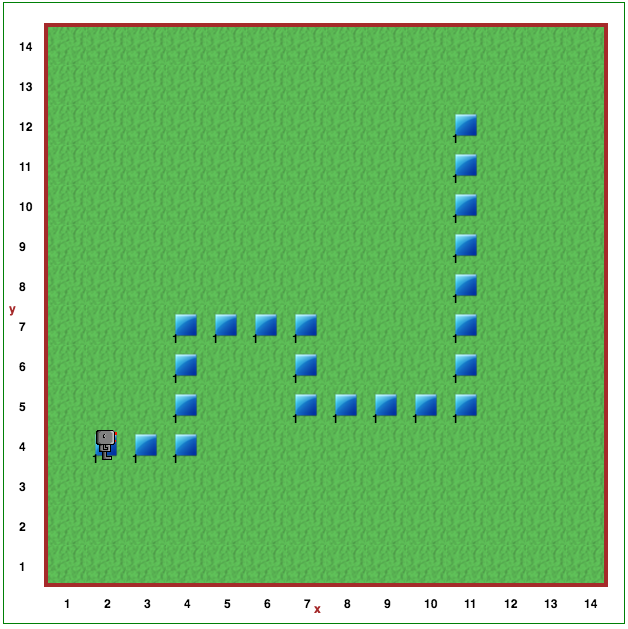
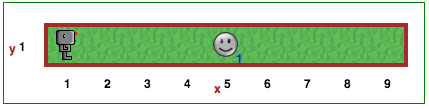
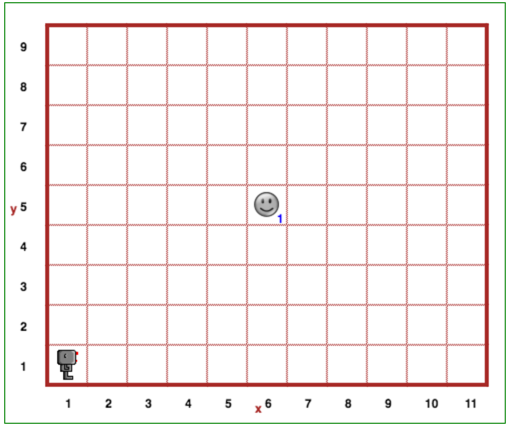

More Challenges
================

.. reveal:: curriculum_addressed
    :showtitle: Curriculum Objectives Addressed In This Section

    - **CS20-CP1** Apply various problem-solving strategies to solve programming problems throughout Computer Science 20.
    - **CS20-CP2** Use common coding techniques to enhance code elegance and troubleshoot errors throughout Computer Science 20.
    - **CS20-FP2** Investigate how control structures affect program flow.
    - **CS20-FP3** Construct and utilize functions to encapsulate reusable pieces of code.

If you have finished off all of steps 1 - 17, and are waiting for your classmates to catch up, take a look at the following challenges. Some of them will require you to do a fair bit of thinking before you begin to code! You will likely find it helpful to think them through with paper/pencil before attempting to write out a solution on the computer.

Star Towers - Version 1
------------------------

Reeborg loves to build - today it is making Star Towers. It has plenty of stars, and wants to make towers that are 3 stars high. Write a program that creates a Star Tower at Reeborg's starting position, and every other x-position after that (odd x-values).

Open the |star_tower1| to implement your solution!

.. |star_tower1| raw:: html

   <a href="https://sk-opentexts.github.io/reeborg?lang=en&mode=python&url=src/worlds/steps/star-tower1.json&name=StarTower1" target="_blank">Star Tower 1 world</a>

The world will look something like this at the start:

When your program is done, the ending world should look like this:

.. image:: images/star_tower1_end.png

Star Towers - Version 2
------------------------

This time Reeborg wants to build star towers in a cave. There are stalactites on the roof of the cave of differing length, so Reeborg wants to make its towers as tall as it can without bumping into them. Like last time, write a program that creates a Star Tower at Reeborg’s starting position, and every other x-position after that (odd x-values). The height of each Star Tower should allow for one empty square beneath the stalactites. 

Open the |star_tower2| to implement your solution!

.. |star_tower2| raw:: html

   <a href="https://sk-opentexts.github.io/reeborg?lang=en&mode=python&url=src/worlds/steps/star-tower2.json&name=StarTower2" target="_blank">Star Tower 2 world</a>

The world will look something like this at the start:

Target Practice
----------------

Reeborg decides to spend the day practicing its archery skills. Somewhere in the world is a triangular object. Write a program so that allows Reeborg to find this object, and then have it create cross hairs that span the whole world and centre on that target.

Open the |target_practice| to implement your solution!

.. |target_practice| raw:: html

   <a href="https://sk-opentexts.github.io/reeborg?lang=en&mode=python&url=src/worlds/steps/target-practice.json&name=TargetPractice" target="_blank">Target Practice world</a>

The world will look something like this at the start:

.. image:: images/target_start.png

Line Follower
--------------

Reeborg loves to hike in the backcounty, but one challenge is that it's sometimes easy to get lost. Write a program to help Reeborg carefully follow the hiking trail and eventually reach the end of the hiking path.

Open the |line_follower| to implement your solution!

.. |line_follower| raw:: html

   <a href="https://sk-opentexts.github.io/reeborg?lang=en&mode=python&url=src/worlds/steps/line-follower.json&name=LineFollower" target="_blank">Line Follower world</a>

The world will look something like this at the start:

Double the Pile
---------------

Reeborg has a pile of squares somewhere in front of it, but wants more! Two times more, to be precise. Reeborg is carrying a large number of squares, which you can use to help build the larger pile it wants. Create a pile of squares with exactly two times as many squares. You will always build the new, bigger pile one square to the right of where you find the initial pile.

Open the |doubler| to implement your solution!

.. |doubler| raw:: html

   <a href="https://sk-opentexts.github.io/reeborg?lang=en&mode=python&url=src/worlds/steps/doubler.json&name=Doubler" target="_blank">Double the Pile world</a>

The world will look something like this at the start:

.. image:: images/doubler_start.png

Find the Center - Version 1
----------------------------

Put down a token in the geometrical center of the following world. You are guaranteed that the **width** of the world will be an odd number, and that it will only be one unit tall. Note that when your program is complete, there should only be one token down in the world.

Open the |find_center_1| to implement your solution!

.. |find_center_1| raw:: html

   <a href="https://sk-opentexts.github.io/reeborg?lang=en&mode=python&url=src/worlds/steps/center1.json&name=FindCenter1" target="_blank">Find Center 1 world</a>

The world will look something like this at the start:

Find the Center - Version 2
----------------------------

Put down a token in the geometrical center of the following world. You are guaranteed that the **width and height** of the world will be odd numbers. Note that when your program is complete, there should only be one token down in the world.

Open the |find_center_2| to implement your solution!

.. |find_center_2| raw:: html

   <a href="https://sk-opentexts.github.io/reeborg?lang=en&mode=python&url=src/worlds/steps/center2.json&name=FindCenter2" target="_blank">Find Center 2 world</a>

The world will look something like this at the start:

