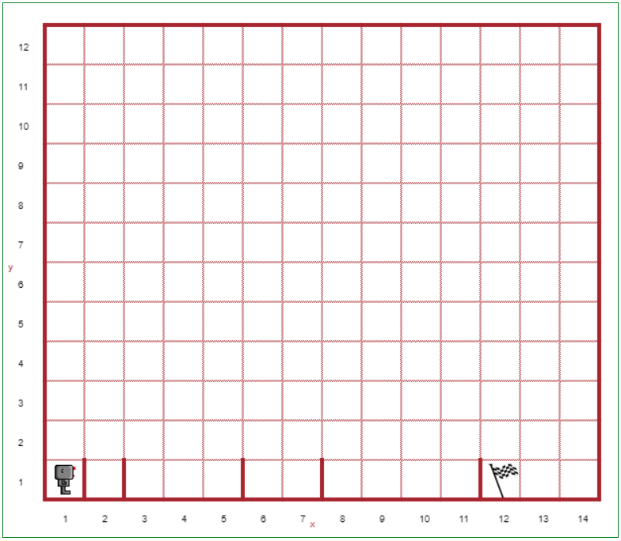

Step 13: If/Elif/Else
=====================

.. reveal:: curriculum_addressed
    :showtitle: Curriculum Outcomes Addressed In This Section

    - **CS20-CP1** Apply various problem-solving strategies to solve programming problems throughout Computer Science 20.
    - **CS20-CP2** Use common coding techniques to enhance code elegance and troubleshoot errors throughout Computer Science 20.
    - **CS20-FP2** Investigate how control structures affect program flow.
    - **CS20-FP3** Construct and utilize functions to create reusable pieces of code.

.. index:: if-elif-else

Tutorial
---------

Reeborg lives in Canada where it not only can rain or be sunny, but snow
can also be falling. Let's suppose that only one of those can happen at a time. Then,
Reeborg could be faced with the following choices::

    if it_rains():
        play_indoors()
    elif it_snows():
        go_skiing()
    else:
        go_swimming() # assuming it is warm!

Notice the use of ``elif`` (which means "else if") for choice 2. If we took into account other
possible weather phenomena, like hail, thunder, fog, drizzle, etc., we
could add other choices using additional ``elif: ...`` code blocks.

Here is a graphical representation of the choices that Reeborg faces:

.. figure:: images/flowcharts/elif.jpg
   :align: center

In Step 10, you wrote a program to make Reeborg jump hurdles. Your program was likely
something like this:

.. code-block:: python

    def turn_right():
        repeat 3:
            turn_left()

    def jump_hurdle():
        #code to make Reeborg jump the hurdle

    repeat 5:
        move()
        jump_hurdle()

Although this code works fine for the hurdle world you were given, **it would fail if the hurdles were not spaced evenly apart**.

Here's a program skeleton that should work for the world we mentioned above,
provided you fill in the missing pieces. *Note: You may find the `done` function (which tells Reeborg to stop doing anything) helpful here.*

.. code-block:: python

   def jump_over_hurdle():
        # suitable definition

   def run_jump_or_finish ():
        if at_goal():
            # something
        elif front_is_clear():
            # something
        else:
            # something

    repeat 42:  #we can replace this with a while after the next step...
        run_jump_or_finish()

Note the structure of the ``if/elif/else`` statements; as is mentioned above,
you should see that it gives three independent choices: **only one of them
will be executed**.

Your Turn
---------

Open Step 13 on the |reeborg_environment|, and copy/paste the following code to begin your solution:

.. code-block:: python

   def jump_over_hurdle():
        # suitable definition

   def run_jump_or_finish ():
        if at_goal():
            done()  #tells Reeborg to stop
        elif front_is_clear():
            # something
        else:
            # something

    repeat 42:  #we can replace this with a while after the next step...
        run_jump_or_finish()

Reeborg is jumping hurdles again. This time, however, the hurdles may not all be the same distance apart. You should use a ``repeat`` loop to have Reeborg jump the hurdles, and end at the goal (12, 1). You **must** use an ``if/elif/else`` structure in your program. 

.. |reeborg_environment| raw:: html

   <a href="https://sk-opentexts.github.io/reeborg/?lang=en&mode=python&menu=worlds/menus/sk_menu.json&name=Step%2013" target="_blank">Reeborg environment</a>

If You're Having Trouble (a more detailed explanation)
------------------------------------------------------

A series of ``if/elif/ ... /else`` statements is equivalent to
inserting the **first** code block that evaluates to ``True``. Thus::

    if False:
        do_1()
    elif True:
        do_2()
    elif True:
        do_3()
    else:
        do_4()

is equivalent to::

    do_2()

whereas::

    if False:
        do_1()
    elif False:
        do_2()
    elif False:
        do_3()
    else:
        do_4()

is equivalent to::

    do_4()

etc.

