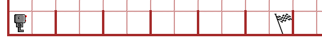
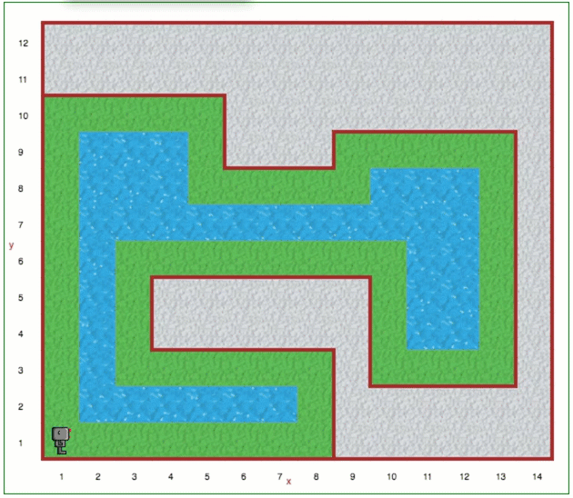

Step 14: The ``not`` Keyword
===============================================

Tutorial
--------

In Python, we can indicate that something is not true by writing ``not True``
which is the same as  ``False``. Likewise, ``not False`` is equivalent to ``True``.

When you solved Step 10, you created a program to have Reeborg jump hurdles.

As part of your solution for the above world, you may have created a function similar to the following:

.. code-block:: python

   def run_jump_or_finish ():
        if at_goal():
            # something
        elif front_is_clear():
            # something
        else:
            # something

This program fragment can be rewritten, by choosing different combinations of the negation keyword ``not`` **and** different combinations of ``if/elif/else``.

Consider the three code samples below, paying close attention to where the ``not`` keyword occur **and** to what is actually included in each code block.

.. code-block:: python

   # first choice:

   def run_jump_or_finish ():
        if at_goal():
            # something
        elif not front_is_clear():
            # something
        else:
            # something

   # second choice ... trickier

   def run_jump_or_finish ():
        if not at_goal():
            if front_is_clear():
                # something
            else:
                # something
        else:
            # something

   # third choice:

   def run_jump_or_finish ():
        if not at_goal():
            if not front_is_clear():
                # something
            else:
                # something
        else:
            # something

You have just seen how it is possible to change the order
in which the conditions appear in an ``if/elif/else`` code block while
still accomplishing the same goal.  Two different programmers will often
use different strategies to get the same final result.  There are other
ways in which different programmers will write different but equivalent
programs: by using different functions.

The function ``front_is_clear()`` will tell Reeborg whether or not a
wall is blocking its way.  It will do the same for **water**, **brick walls**,
**fences**, etc., which we have not seen yet but likely will in future worlds.
There is a function that is more specific to wall called
``wall_in_front()``; I leave it up to you to guess what it does.

Your Turn
---------

Open Step 14a on the |reeborg_environment|.

.. image:: images/step14a.gif

Reeborg loves going for walks, especially when it is around a lake. The lakes in Reeborg's neighborhood are all different sizes of rectangles, so Reeborg does not know how many steps it will take to get back to the start of walk. Thankfully, Reeborg happens to be carrying a banana, which you can tell Reeborg to ``put()`` down at the start of it's walk. Reeborg knows it's done walking when it reaches the banana again.

Use a ``while`` statement (looking for the banana object) and an ``if/else`` to have Reeborg complete his walking adventure.

.. note:: Reeborg cannot use a ``repeat`` statement, since it has no idea of the dimensions of the lake it is walking around.

.. |reeborg_environment| raw:: html

   <a href="https://sk-opentexts.github.io/reeborg" target="_blank">Reeborg environment</a>

Extra for Experts
------------------

Reeborg has found a much more interesting lake to walk around. 

Try to adapt the solution for the basic world to also work with this new lake. Reeborg should once again put down the banana at the starting position and continue walking along the border of the lake until it finds the banana again. Staying along the wall will be trickier this time, but that's the challenge!

.. note:: Your solution for the Extra for Experts world should also work in the basic (Step 14a) world!

