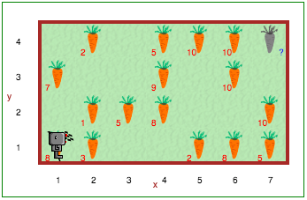

Step 17: Harvest Time Revisited
================================

Tutorial
---------

As you consider how you will write a solution for the following situation, be sure to consider:

- writing pseudocode with paper/pencil before you begin to code
- use the library to store functions you might use again (such as ``from library import go_to_start()``) 
- use comments and whitespace (blank lines) to keep your code as readable as possible for other humans

Your Turn
----------

Open Step 17 on the |reeborg_environment|.

Reeborg is harvesting carrots again. This time, however, the gardens are all different sizes. The carrots grow really well in some areas (so there are more than one in some spots), and not well at all in some spots (so there are places where no carrots grow). Reeborg can start anywhere in the garden, and can be facing in any direction. One possible garden looks like this: 

Reeborg's job is to pick all the carrots, put them down in the big carrot bin at the north-east corner of the garden, then head back to the south-west corner of the garden for a well deserved rest.

.. |reeborg_environment| raw:: html

   <a href="https://sk-opentexts.github.io/reeborg" target="_blank">Reeborg environment</a>