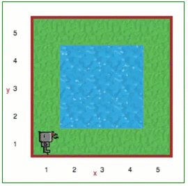

Step 3: Turning Left and Stepping Through Code
==============================================

.. reveal:: curriculum_addressed
    :showtitle: Curriculum Outcomes Addressed In This Section

    - **CS20-CP1** Apply various problem-solving strategies to solve programming problems throughout Computer Science 20.
    - **CS20-CP2** Use common coding techniques to enhance code elegance and troubleshoot errors throughout Computer Science 20.

Tutorial
--------

Reeborg's Bugs
~~~~~~~~~~~~~~

In computer jargon, a bug is an error that causes a program to behave in
an unexpected way. If you are writing computer programs, you are going
to have bugs in them sooner or later - everybody does. Good programmers
seek to "remove" bugs or "fix" them as soon as they find that their
program behaves unexpectedly.

Not so good programmers state that "bugs" are not really bugs but that
they are "features" of their programs. **You** are going to be a good
programmer, unlike the maker of Reeborg, whose program is littered with
bugs. Some of the problems with Reeborg are:

   
#. Reeborg has an oil leak. Oil leaks are damaging for the environment
   and inconvenient for Reeborg who must replenish its supplies when
   it's not busy accomplishing tasks. The maker of Reeborg claims that
   it is a feature, as it enables you to follow Reeborg's path, just
   like any programmer can learn to "trace" a program.
#. Reeborg's steering mechanism is not handled properly by Reeborg's
   program: it can only turn left. The maker of Reeborg, once again,
   claims that this is a feature as it present you with an opportunity
   to learn about **functions**. You will soon learn how
   to program a *workaround solution*, enabling Reeborg to turn right,
   although in a wasteful fashion. 
#. Reeborg has a compass, enabling it to determine which direction it
   is facing. Unfortunately, yet again, the program that enables Reeborg
   to get the information from the compass has a bug: it only tells
   Reeborg if it is facing North ... or not. Once again, you will 
   learn how to implement a workaround solution soon.
#. Reeborg can see if a wall is in front of it, and can also turn its
   head to the right to see if there is a wall there. However, a
   software "glitch" (which is another weasel term that software
   manufacturers use to avoid having to say that their product has a
   bug) prevents Reeborg's program from properly registering a wall when
   it turns its head left.

Stepping Through Code
~~~~~~~~~~~~~~~~~~~~~

Sometimes to find the cause of bugs, it can help to break the normal
flow of the program. To this end you may do one or more of the
following:

#. You can *pause* a program as it is running by pressing the **pause**
   button. This is similar to what people refer to as
   setting a *breakpoint* in a computer program

   |pauseButton|

#. Instead of actually pressing the pause button, you can type in the
   instruction ``pause()`` at any point inside a program and Reeborg
   will pause, awaiting your permission to continue.

#. You can *step through* a program, one instruction at a time, by
   pressing the *execute one instruction and pause*, or **step** button.
   By default, the line about to be executed is highlighted; you can turn off
   the highlighting by clicking on a button above the code editor.

   |stepButton|

#. You can stop a program at any point by pressing the **stop**
   button; this unfortunately may not work if you create
   what is known as an infinite loop, outside of Reeborg's control. If
   worse comes to worst, you can always just reload the web page.

   |stopButton|

.. |pauseButton| image:: images/pause_button.png

.. |stepButton| image:: images/step_button.png

.. |stopButton| image:: images/stop_button.png

Your Turn
---------

Open Step 3 on the |reeborg_environment|.

As mentioned above, Reeborg can only turn in one direction: left. To tell Reeborg to turn, you can use the ``turn_left()`` function.

Use the ``move()`` function and the ``turn_left()`` function to make Reeborg walk around the lake.

.. topic:: Try this!

    To see what happens, let's do some things intentionally wrong. For example, make Reeborg walk into the lake. You might also want to try not walking all the way around the lake to see what the error message will be.

.. |reeborg_environment| raw:: html

   <a href="https://sk-opentexts.github.io/reeborg/?lang=en&mode=python&menu=worlds/menus/sk_menu.json&name=Step%203" target="_blank">Reeborg environment</a>