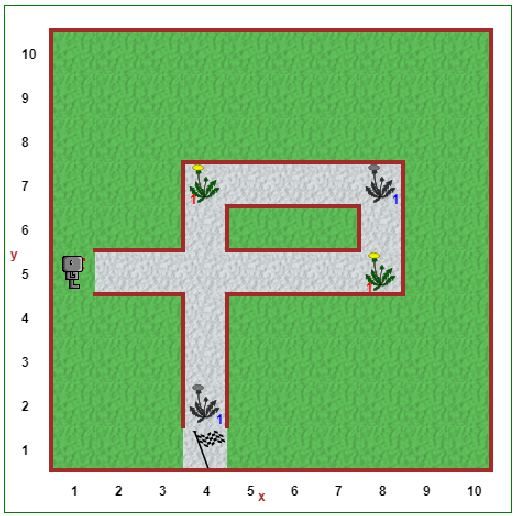

Step 4: Comments
==================================

.. important::

     Write your computer programs to make them easy for **people** to
     read and understand.

.. reveal:: curriculum_addressed_step4
    :showtitle: Curriculum Outcomes Addressed In This Section

    - **CS20-CP1** Apply various problem-solving strategies to solve programming problems throughout Computer Science 20.
    - **CS20-CP2** Use common coding techniques to enhance code elegance and troubleshoot errors throughout Computer Science 20.

.. index:: comments

Tutorial
--------

When writing programs, you should write them so that other people, just
like you, would find them easy to read, and be able to figure out what
they do. Yes, computer languages are designed to allow you to
communicate with computers, just as human languages have evolved to
allow humans to communicate with each other. But computer languages,
which are much simpler than human languages, are often used by
programmers to share their work with other programmers.

Comments are notes made by a programmer which are ignored by the
computer; they are meant to be read and understood only by humans. They allow programmers to write programs that are easier to understand for other people.

When using Python, you can write comments in one of two ways:

-  By putting a ``#`` before a comment on any given line.
-  By enclosing any amount of text (even if it takes up more than one line) between triple-quotes like ``""" ... """`` or ``''' ... '''``.

Here's a simple program that makes Reeborg move in a square, but there's a mistake in the code. Can you spot it?

.. code-block:: python

    move()
    move()
    turn_left()
    put()
    move()
    move()
    turn_left()
    put()
    move()
    turn_left()
    put()
    move()
    move()
    turn_left()
    put()

Now here's the exact same program, at least from Reeborg's point of
view, but with comments added for humans; you will be able to recognize
comments as they appear in a different colour and font style.

.. code-block:: python

    # This is an example of
    # a simple program where Reeborg draws a square,
    # leaving an object behind at each corner.

    # draw the first side
    move()
    move()
    turn_left()
    put()  

    # draw the second side
    move()
    move()
    turn_left()
    put()

    # draw the third side
    move()
    turn_left()
    put()

    # draw the fourth side
    move()
    move()
    turn_left()
    put()

Hopefully this second version makes it much easier to spot the error in the code. Note that in addition to comments, the code has been broken in to "logical chunks" of code, and each "chunk" has a comment above it explaining what the chunk of code will do. This is an excellent way to organize your code.

Your Turn
----------

Open Step 4 on the |reeborg_environment|.

Use the functions we've learned about so far to make Reeborg walk down the gravel path, picking up dandelions as it finds them, and depositing them in the conveniently placed garbage cans (represented by greyscale dandelion images). Use the ``pause`` function to have Reeborg wait at each location it finds a dandelion to pick. Be sure to use comments and whitespace to increase the readability of your solution!

Recall that the functions discussed so far include:

-  ``move()``
-  ``turn_left()``
-  ``take()``
-  ``put()``
-  ``pause()``

.. |reeborg_environment| raw:: html

   <a href="https://reeborg.cs20.ca/?lang=en&mode=python&menu=worlds/menus/sk_menu.json&name=Step%204" target="_blank">Reeborg environment</a>