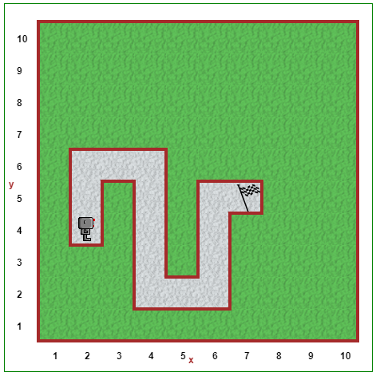

Step 6: Saving Functions in the Library
=======================================

Tutorial
---------

In addition to having Reeborg making right turns, you *might* have had
him turn around a few times; by turning around, I mean changing
direction so that Reeborg is heading back to where it was coming from.
We can define a function ``turn_around()`` as follows::

    def turn_around():
        turn_left()
        turn_left()

When programmer make use of a given function in different programs,
rather than redefining it in each program they write, they put them in
special programs called **libraries** and they have a way to ensure that
their other programs can use the functions that are found in the
library.

You are going to use the function ``turn_right()`` **a lot!** Instead of
rewriting it each time, what you are going to do is
to write it **once** (more) but, this time, instead of writing it in the
editor with the **Python Code** tab, you will click on the **library** tab and
write it there. Oh, and you should also define ``turn_around()`` there as
well.

.. image:: images/library.png

Then, when you want to use the functions defined in your library, you will
simply type ``from library import`` (followed by the function names, separated
by commas) on its own line in the Python Code editor.

.. note:: 

    We use the ``from library import`` command during our Reeborg explorations, which allows you to simply type in ``turn_right()``. Later in the course, we will switch to using the ``import library`` command, which will require you to type ``library.turn_right()`` to call the function.

Your Turn
----------

Open Step 6 on the `Reeborg website <https://sk-opentexts.github.io/reeborg>`_ .

Reeborg needs to go pick up the newspaper (The **Star** Phoenix) that is sitting outside his house. If you haven't done it yet, define both the ``turn_right()`` and ``turn_around()`` functions in the library tab. Now use the functions defined in the library to have Reeborg pick up the newspaper, walk back into the house, put the newspaper down, and turn off. Once again, be sure to use comments and whitespace to increase the readability of your solution!

