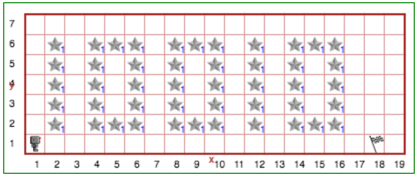

Step 7: Thinking and Birthday Message
=======================================

Tutorial
------------

You may have noticed that Reeborg takes a bit of time
between each command; that is because it must "think"
about what you are asking it to do.  However, one can
change the amount of time Reeborg takes to think by using
the ``think()`` function with an argument, like
this:

.. code-block:: python

    think(500)

The number ``500`` which appears between the parentheses
is what we call an *argument* of a function. The smaller
the number, the less time Reeborg will take before
considering each action.  A value of 1000 means that
Reeborg takes about 1 second to think.  Sometimes, Reeborg has something to think about that you are not aware of, so it may sometimes seem to think
for longer than you'd expect it to. Calling ``think(0)`` tells Reeborg to move as quickly as it can.

.. image:: images/think.gif

Your Turn
---------

Open Step 7 on the `Reeborg website <https://sk-opentexts.github.io/reeborg>`_ .

Reeborg has just turned 18 and wants to let everyone in the universe to know it. He thinks it would be a funny joke to plant daisies on the front yard to celebrate. Reeborg is a robot and only knows binary, and 18 in decimal is represented as 10010 in binary.

Define these new functions:

- ``draw_one()`` to plant the number 1 with daisies
- ``draw_zero()`` to plant the number 0 with daisies

Use the functions you have created to plant his birthday message. Each instruction should properly position and orient Guido for the next digit. Be sure to use comments and whitespace to increase the readability of your solution!

