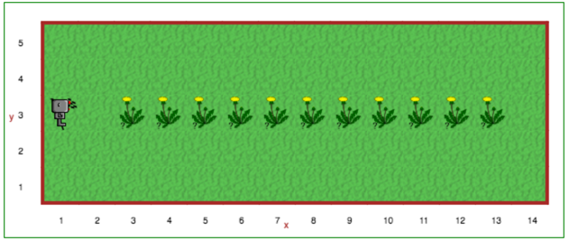

Step 8: Asking Questions
=======================================

Tutorial
--------

Sometimes, we don't know ahead of time exactly what the world that Reeborg is going to be faced with will look like. Thankfully, Reeborg can sense the world around it, and we can ask Reeborg questions about it.

.. code-block:: python

    if True:
        move()

    if False:
        turn_left()

In the code above, ``if``, ``True``, and ``False`` are all Python keywords. It is a good idea to try out the code above in Reeborg's World. You might also want
to interchange the True and False, then run the program again to see what happens.

The so-called ``if`` **statement** follows a pattern somewhat similar to
that of ``function``\ s :

.. code-block:: python

    def some_name():
        # block of code

    if some_condition:
        # block of code

How to think of ``if`` statements
~~~~~~~~~~~~~~~~~~~~~~~~~~~~~~~~~~

When we introduced functions, we explained how we could think of a
function **call** as being somewhat equivalent to inserting the code block for
the function definition at that point in the program. Thus::

    move()
    turn_right()  # function call
    move()

is equivalent to::

    move()
    # begin of code block inside turn_right()
    turn_left()
    turn_left()
    turn_left()
    # end of code block
    move()

``if`` statements can be thought in similar terms, except that we have a
*conditional* insertion (or rather **deletion**!). Thus::

    move()
    if True:
        turn_left()
        turn_left()
    move()

is equivalent to::

    move()
    turn_left()
    turn_left()
    move()

whereas::

    move()
    if False:
        turn_left()
        turn_left()
    move()

is equivalent to::

    move()
    move()

Note that thinking of it this way does not mean that such a deletion
would be done permanently: if, somehow, our program *looped back* and
repeated this part of the code again, the ``if`` statement would be
reevaluated each time to decide whether or not to execute the lines of
code inside the code block.

We can represent the above using a flowchart:

.. figure:: images/flowcharts/if.jpg
   :align: center

More useful that you might think...
~~~~~~~~~~~~~~~~~~~~~~~~~~~~~~~~~~~~

.. note::

    The general term used to describe a function that gives a result
    equivalent to ``True`` or ``False`` in an ``if`` statement is **condition**::

       if condition:
           ...

Having to specify ``True`` or ``False`` does not help Reeborg decide on
its own. However, there are special functions that Reeborg recognizes
that allow to decide things for himself. The first of these is
``object_here()`` which tells Reeborg that there is at least one object at
the grid position where he is located. For example, if we want to ask
Reeborg to collect tokens, one part of the code could be::

    if object_here():
        take()

.. topic:: Try it!

    Copy the above in the Code editor, filling in the missing
    commands, and test your program on both worlds **Tokens 1** and **Tokens 2**.

.. admonition:: For educators

    The function ``object_here()`` returns a list of object types (as strings)
    found at a given location.  For example, if there are stars and tokens
    at the same location, ``object_here()`` could return ``["star", "token"]``
    or ``["token", "star"]``. If no object is present, an empty list is
    returned.  As you likely already know, Python treats an empty list as
    being equivalent to ``False`` in an ``if`` statement, and a non-empty
    list as equivalent to ``True``.

    If many objects could potentially be found in a given world, and we
    are interested in only one object type, we can specify it as a function
    argument::

        if object_here("token"):
            take("token")

    ``object_here("token")`` will either return an empty list or the list
    ``["token"]``.

Your Turn
---------

Open Step 8 on the `Reeborg website <http://wmcicompsci.ca/reeborg>`_ .

Reeborg has just turned 18 and wants to let everyone in the universe to know it. He thinks it would be a funny joke to plant daisies on the front yard to celebrate. Reeborg is a robot and only knows binary, and 18 in decimal is represented as 10010 in binary.

Define these new functions:

- ``draw_one()`` to draw a numeral 1 in beepers
- ``draw_zero()`` to draw a numeral 0 in beepers

Use the functions you have created to plant his birthday message. Each instruction should properly position and orient Guido for the next digit. Be sure to use comments and whitespace to increase the readability of your solution!

