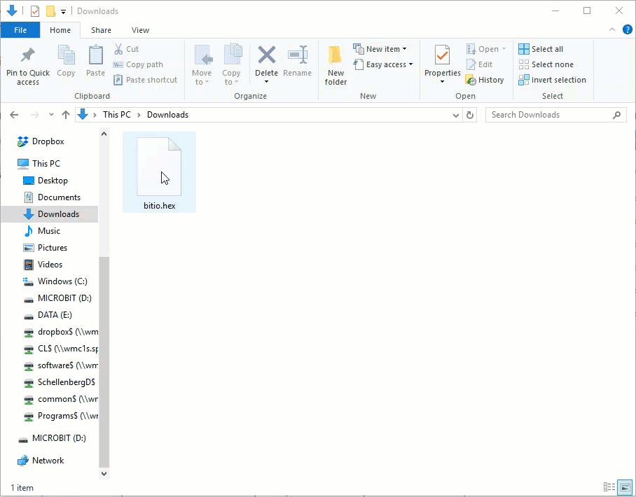

.. _microbit_reference:

Micro:bit Reference
====================

There are no official docs yet, but here is a short quick-reference to get you started. These following demo code is from the `bito module readme file <https://github.com/whaleygeek/bitio>`_.

If you haven't used the Micro:bit before, you will want to check out the :ref:`microbit_setup` instructions at the bottom of this page.

Connecting to the micro:bit
----------------------------

.. sourcecode:: python
    
    # NOTE: Make sure bitio.hex is installed
    import microbit

Scrolling text on the screen
-----------------------------

.. sourcecode:: python
    
    import microbit
    microbit.display.scroll("Hello")

Displaying a single character
---------------------------------

.. sourcecode:: python
    
    import microbit
    microbit.display.show("A")

Displaying numbers
---------------------------------

.. sourcecode:: python
    
    import microbit
    microbit.display.scroll(2345)

Displaying numbers using a 2-digit font
------------------------------------------

.. sourcecode:: python
    
    import microbit
    import time
    for n in range(99):
        microbit.display.show(n)
        time.sleep(0.25)

Getting a list of pre-defined images
--------------------------------------

The full list of pre-defined images is at the bottom of this page as well.

.. sourcecode:: python
    
    import microbit
    print(microbit.Image.STD_IMAGE_NAMES)

Displaying a pre-defined image
--------------------------------------

.. sourcecode:: python
    
    import microbit
    microbit.display.show(microbit.Image.HAPPY)

Spinning a clock
--------------------------------------

.. sourcecode:: python
    
    import microbit
    import time
    for c in microbit.Image.ALL_CLOCKS:
        microbit.display.show(c)
        time.sleep(0.25)

    
Defining a custom image
--------------------------------------

.. sourcecode:: python
    
    import microbit
    BANANA = microbit.Image("00090:00090:00990:09900:99000")
    microbit.display.show(BANANA)

Clearing the display
--------------------------------------

.. sourcecode:: python
    
    import microbit
    microbit.display.clear()

Sensing when a button is pressed
--------------------------------------

.. sourcecode:: python
    
    import microbit
    import time
    while True:
        if microbit.button_a.was_pressed():
            microbit.display.show("A")
            time.sleep(0.5)
            microbit.display.clear()

    
Sensing when a pin is touched
--------------------------------------

.. sourcecode:: python
    
    import microbit
    import time
    while True:
        if microbit.pin0.is_touched():
            microbit.display.show("T")
            time.sleep(0.5)
            microbit.display.clear()

    
Reading accelerometer values
--------------------------------------

.. sourcecode:: python
    
    import microbit
    import time
    while True:
        print(microbit.accelerometer.get_values())
        time.sleep(0.25)

  
Sensing tilt in the X plane
--------------------------------------

.. sourcecode:: python
    
    import microbit
    import time
    while True:
        x = microbit.accelerometer.get_x()
        x = abs(x)
        if x > 200:
            print("Tilted")
        else:
            print("Not Tilted")
        time.sleep(0.5)

Reading the temperature
--------------------------------------

.. sourcecode:: python
    
    import microbit
    import time
    while True:  
        print(microbit.temperature())
        microbit.sleep(0.5)

.. _microbit_predefined_images:

List of Pre-Defined Images
---------------------------

    - ``Image.HEART``
    - ``Image.HEART_SMALL``
    - ``Image.HAPPY``
    - ``Image.SMILE``
    - ``Image.SAD``
    - ``Image.CONFUSED``
    - ``Image.ANGRY``
    - ``Image.ASLEEP``
    - ``Image.SURPRISED``
    - ``Image.SILLY``
    - ``Image.FABULOUS``
    - ``Image.MEH``
    - ``Image.YES``
    - ``Image.NO``
    - ``Image.CLOCK12``, ``Image.CLOCK11``, ``Image.CLOCK10``, ``Image.CLOCK9``,
      ``Image.CLOCK8``, ``Image.CLOCK7``, ``Image.CLOCK6``, ``Image.CLOCK5``,
      ``Image.CLOCK4``, ``Image.CLOCK3``, ``Image.CLOCK2``, ``Image.CLOCK1``
    - ``Image.ARROW_N``, ``Image.ARROW_NE``, ``Image.ARROW_E``,
      ``Image.ARROW_SE``, ``Image.ARROW_S``, ``Image.ARROW_SW``,
      ``Image.ARROW_W``, ``Image.ARROW_NW``
    - ``Image.TRIANGLE``
    - ``Image.TRIANGLE_LEFT``
    - ``Image.CHESSBOARD``
    - ``Image.DIAMOND``
    - ``Image.DIAMOND_SMALL``
    - ``Image.SQUARE``
    - ``Image.SQUARE_SMALL``
    - ``Image.RABBIT``
    - ``Image.COW``
    - ``Image.MUSIC_CROTCHET``
    - ``Image.MUSIC_QUAVER``
    - ``Image.MUSIC_QUAVERS``
    - ``Image.PITCHFORK``
    - ``Image.XMAS``
    - ``Image.PACMAN``
    - ``Image.TARGET``
    - ``Image.TSHIRT``
    - ``Image.ROLLERSKATE``
    - ``Image.DUCK``
    - ``Image.HOUSE``
    - ``Image.TORTOISE``
    - ``Image.BUTTERFLY``
    - ``Image.STICKFIGURE``
    - ``Image.GHOST``
    - ``Image.SWORD``
    - ``Image.GIRAFFE``
    - ``Image.SKULL``
    - ``Image.UMBRELLA``
    - ``Image.SNAKE``
      
.. _microbit_setup:

Micro:bit Setup
----------------

Installing a Driver If Using Legacy Windows OS
~~~~~~~~~~~~~~~~~~~~~~~~~~~~~~~~~~~~~~~~~~~~~~~~~

**The following only applies to users of Windows that are on a version earlier than Windows 10. If you are using Windows 10, Mac, or Linux, you can skip this step.**

If you are on a Windows machine (*< Windows 10*), you will need to download the `mbed driver <https://os.mbed.com/handbook/Windows-serial-configuration>`_ if you want to use your Micro:bit as an input/output device. Note that you will need to have a Micro:bit plugged into your machine when installing the driver, and that it requires admin rights. If you want to simply run code on your Micro:bit, and not communicate with your computer, no driver is required for any platform (but this does really limit the types of interesting things that can be done, and none of the examples in the textbook will work).

Micro:bit Modes
~~~~~~~~~~~~~~~

Your Micro:bit can be used in two modes:

- running "flashed" code, independent of a computer (can run on batteries, or through power supplied via the computers USB port)
- communicating through the serial port with your computer as an input/output device

For the purposes of this textbook, we will always be using the Micro:bit as an input/output device by communicating over a USB connection.

.. note::
    
    If you want to learn more about how to use the Micro:bit without it being hooked up to a computer, you can find out about how to do that on the `Microbit website <http://microbit.org/>`_.

Flashing the Micro:bit
~~~~~~~~~~~~~~~~~~~~~~

While your Micro:bit is connected to your computer via USB, it is possible to send instructions to the Micro:bit using serial commands. In order to do this, we first need to flash the Micro:bit with a micropython .hex file. This lets you use a BBC Micro:bit in Python to sense the physical world around you, and to output to LEDs (and much more, if you hook up additional sensors). **You should only have to do this once**, unless you flash the Micro:bit with a different .hex file in order to use it without being tethered to a computer.

To flash your Micro:bit, first connect your Micro:bit to your computer via USB. Now download the :download:`bitio.hex <../Microbit/bitio.hex>` file to your computer. Drag the .hex file onto your Micro:bit in the Windows Explorer (or Mac Finder), as shown below.

You should now see an I/O image on the LED grid of the Micro:bit, which tells you that your Micro:bit is ready to communicate with Python (though you still need to install a module in Thonny, as described below).

.. image:: images/bitio.png

.. note:: The bitio.hex file is from the `bitio package <https://github.com/whaleygeek/bitio>`_ written by David Whale. This is the package we are about to install to communicate with the Micro:bit. Since the bitio package is not published on PIP, I (Dan Schellenberg) simply packaged it in a format that makes it easy to install via Thonny. Even though it is called cs20-microbitio, it is really just the bitio package.

Installing the Micro:bit Module in Thonny
~~~~~~~~~~~~~~~~~~~~~~~~~~~~~~~~~~~~~~~~~~~

In order to communicate with the microbit in Python, you need to install the ``cs20-microbitio`` package in Thonny. To do that, go to Tools -> Manage packages..., type in ``cs20-microbitio`` into the search bar, and install. You only need to do this once, after which you should be able to use ``import microbit`` whenever you want to interact with the Micro:bit in Python.

Using the Micro:bit
--------------------

Once you have done that, try running the code below::

    import microbit

    microbit.display.scroll("Hey there, CS20")

When you press Run, there will be a prompt in the console telling you to disconnect the Micro:bit, then press ENTER. Follow the prompts, which allow the bitio module to detect which device connected to your computer is the Micro:bit. The console will look something like this:

    | No micro:bit has previously been detected
    | Scanning for serial ports
    | remove device, then press ENTER
    | scanning...
    | found 132 device(s)
    | plug in device, then press ENTER
    | scanning...
    | found 133 device(s)
    | found 1 new device
    | selected:/dev/tty.usbmodem1422
    | Do you want this device to be remembered? (Y/N)Y
    | connecting...
    | Your micro:bit has been detected
    | Now running your program

Once the connection is established, you should see the message scroll across the 5x5 LED grid on your Micro:bit.

