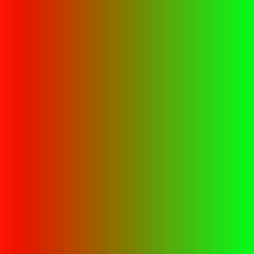
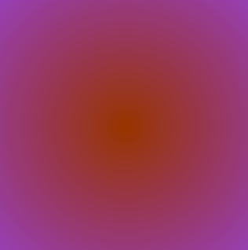

Image Processing With Conditionals
===================================

.. topic:: Quick Overview of Day

    Use nested loops to practice simple image processing, this time including conditionals to control when certain effects are done.

.. reveal:: curriculum_addressed
    :showtitle: Curriculum Outcomes Addressed In This Section

    - **CS20-CP1** Apply various problem-solving strategies to solve programming problems throughout Computer Science 20.
    - **CS20-FP1** Utilize different data types, including integer, floating point, Boolean and string, to solve programming problems.
    - **CS20-FP2** Investigate how control structures affect program flow.
    - **CS20-FP3** Construct and utilize functions to encapsulate reusable pieces of code.

Applying an Effect Based on Pixel Colour
---------------------------------------------

Say you had an image that looked like this:

.. raw:: html

    
    <h4 style="text-align: center;">moon.jpg</h4>

Due to the contrast in the image, we can apply certain effects to only a portion of the image. For example, we could turn the sky (which is currently black) into another colour, while leaving the moon itself untouched. The following code turns the sky a light gray colour.

.. activecode::  isolate_the_moon
    :nocodelens:

    # import the module so we can access images
    import image

    # open an image 
    img = image.Image("moon.jpg")

    # figure out how large the image is
    width = img.get_width()
    height = img.get_height()

    # make a window to draw on
    win = image.ImageWin(width, height)

    # draw the original image onto the window
    img.draw(win)
    img.set_delay(1,15)   # set_delay(0) turns off animation

    # use a nested for loop to look at every pixel in the image
    for x in range(width):
        for y in range(height):
            # get the current pixel
            this_pixel = img.get_pixel(x, y)

            # access the amount of red, green and blue for this pixel
            r = this_pixel.get_red()
            g = this_pixel.get_green()
            b = this_pixel.get_blue()

            # apply any effect to the pixels
            if r + g + b < 30:
                new_red = 100
                new_green = 100
                new_blue = 100
            else:
                new_red = r
                new_green = g
                new_blue = b

            # create a new pixel with changed values
            new_pixel = image.Pixel(new_red, new_green, new_blue)

            # reassign the pixel value in the image to be the changed version
            img.set_pixel(x, y, new_pixel)

    # draw the changed image to the window
    img.draw(win)

Try This
~~~~~~~~~~

Adapt the code above to:

- change the color of the sky to a different colour (something other than gray)
- instead of changing the sky, adapt the program to tint the moon slightly blue
- switch the image to be ``bird-far.jpg``, then change the program so that all of the sky is "erased" (turned white), while the bird itself is left alone

Applying an Effect to an Area of an Image
------------------------------------------

You might want to affect only one area of an image. For example, perhaps you want to make the left half of the following image grayscale, but leave the right half of the image unchanged. 

.. raw:: html

    
    <h4 style="text-align: center;">sneakers.jpg</h4>

To apply an effect to just the left hand side, we can write a program that iterates through every pixel, but only apply the grayscale effect if the x coordinate is in the left half of the image. Here is a program that does just that:

.. activecode::  grayscale_left_half
    :nocodelens:

    # import the module so we can access images
    import image

    # open an image 
    img = image.Image("sneakers.jpg")

    # figure out how large the image is
    width = img.get_width()
    height = img.get_height()

    # make a window to draw on
    win = image.ImageWin(width, height)

    # draw the original image onto the window
    img.draw(win)
    img.set_delay(1,15)   # set_delay(0) turns off animation

    # use a nested for loop to look at every pixel in the image
    for x in range(width):
        for y in range(height):
            # get the current pixel
            this_pixel = img.get_pixel(x, y)

            # access the amount of red, green and blue for this pixel
            r = this_pixel.get_red()
            g = this_pixel.get_green()
            b = this_pixel.get_blue()

            # apply any effect to the pixels
            if x < width/2:
                average = int((r + b + g) / 3)
                new_red = average
                new_green = average
                new_blue = average
            else:
                new_red = r
                new_green = g
                new_blue = b

            # create a new pixel with changed values
            new_pixel = image.Pixel(new_red, new_green, new_blue)

            # reassign the pixel value in the image to be the changed version
            img.set_pixel(x, y, new_pixel)

    # draw the changed image to the window
    img.draw(win)

Try This
~~~~~~~~~

Adapt the code above to:

- adapt the program so that the left half of the image remains unchanged, but the right of the image is converted to grayscale 
- adapt the program so that the bottom half of the image is converted to grayscale
- change the program so that the animation of the pixel manipulation goes from top to bottom (instead of left to right)

Combining Images
-----------------

If you want to combine two images together, you need to copy the pixel information from one image onto the pixel information of the other image. For example, if we want to have the smile emoji below show up in the image of the rooster, we need to look through each of the pixels in the smile image to see if we are looking at a white background pixel, or part of the image that we should be copying over to the rooster image. *Note that to make this example simpler, the teeth in the smile emoji have been turned slightly off-white, and the color of the emoji has been changed so that the yellow value of the emoji is (248, 216, 102).*

.. raw:: html

    
    <h4 style="text-align: center;">smile.png</h4>

.. raw:: html

    
    <h4 style="text-align: center;">rooster.jpg</h4>

When we are copying the smile over to the rooster image, we can adjust where the smile should appear by adding/subtracting some value from x or y when we call ``original_image.set_pixel()`` on line 36.

.. activecode::  combining_images
    :nocodelens:

    # import the module so we can access images
    import image

    # open the original image and the image to add
    original_img = image.Image("rooster.jpg")
    img_to_add = image.Image("smile.png")

    # figure out how large the image to add is
    width_small = img_to_add.get_width()
    height_small = img_to_add.get_height()

    # figure out how large the original image is
    width = original_img.get_width()
    height = original_img.get_height()

    # make a window to draw on
    win = image.ImageWin(width, height)

    # draw the original image onto the window
    original_img.draw(win)
    original_img.set_delay(1,15)   # set_delay(0) turns off animation

    # use a nested for loop to look at every pixel in the image to add
    for x in range(width_small):
        for y in range(height_small):
            # get the current pixel
            this_pixel = img_to_add.get_pixel(x, y)

            # access the amount of red, green and blue for this pixel
            r = this_pixel.get_red()
            g = this_pixel.get_green()
            b = this_pixel.get_blue()

            # check if this is NOT a white background pixel
            if r < 250 and g < 250 and b < 250:
                original_img.set_pixel(x, y + 135, this_pixel)

    # draw the changed image to the window
    original_img.draw(win)

Try This
~~~~~~~~~

Adapt the code above to:

- adapt the program the smile shows up on top of the rooster's head

Practice Problems
------------------

For the following problems, use one of the images from the examples above, or one of these new ones:

.. raw:: html

    
    <h4 style="text-align: center;">bird-far.jpg</h4>

.. raw:: html

    
    <h4 style="text-align: center;">berries.jpg</h4>

.. raw:: html

    
    <h4 style="text-align: center;">giraffe.jpg</h4>

.. raw:: html

    
    <h4 style="text-align: center;">ban.png</h4>

No Red Left Side
~~~~~~~~~~~~~~~~~~~

Write a program that sets the red intensity of all pixels on the left half of the picture to be 0. On the right side of the picture, the red intensity should remain the same as the original value. The green and blue intensities should remain the same as the original for all parts of the image.

 .. activecode::  practice_problem_no_red_left_side
    :nocodelens:

    import image

    img = image.Image("berries.jpg")
    win = image.ImageWin(img.get_width(), img.get_height())
    img.draw(win)
    img.set_delay(1,15)   # set_delay(0) turns off animation

    # your code goes here!    

    img.draw(win)

Blue Tint Top Right
~~~~~~~~~~~~~~~~~~~~

Write a program that makes the top right quarter of the image be tinted blue (increase the amount of blue).

 .. activecode::  practice_problem_blue_tint_top_right
    :nocodelens:

    import image

    img = image.Image("bird-far.jpg")
    win = image.ImageWin(img.get_width(), img.get_height())
    img.draw(win)
    img.set_delay(1,15)   # set_delay(0) turns off animation

    # your code goes here!    

    img.draw(win)

Change the Rooster Colour
~~~~~~~~~~~~~~~~~~~~~~~~~~~~

Write a program that changes the colour of the rooster's comb and wattle (the red stuff on the rooster's head) from red to blue. *Note that your program will likely only partially work. That is okay! The edges of the converted parts of the image do not need to be clean.*

 .. activecode::  practice_problem_change_rooster_colour
    :nocodelens:

    import image

    img = image.Image("rooster.jpg")
    win = image.ImageWin(img.get_width(), img.get_height())
    img.draw(win)
    img.set_delay(1,15)   # set_delay(0) turns off animation

    # your code goes here!    

    img.draw(win)

Repeat Left Twice
~~~~~~~~~~~~~~~~~~~~~~

Write a program that takes the left side of an image and displays it both on the left half, and the right half, of the image. In other words, replace the right side of the image with a copy of the left side of the image.

 .. activecode::  practice_problem_repeat_left_twice
    :nocodelens:

    import image

    img = image.Image("rooster.jpg")
    win = image.ImageWin(img.get_width(), img.get_height())
    img.draw(win)
    img.set_delay(1,15)   # set_delay(0) turns off animation

    # your code goes here!    

    img.draw(win)

Mirror Horizontal
~~~~~~~~~~~~~~~~~~~~~~

Write a program that mirrors an image from left to right around a vertical line of symmetry in the middle of the image. *Hint: you'll need to figure out how far away from the line of symmetry you are...*

 .. activecode::  practice_problem_mirror_horizontal
    :nocodelens:

    import image

    img = image.Image("berries.jpg")
    win = image.ImageWin(img.get_width(), img.get_height())
    img.draw(win)
    img.set_delay(1,15)   # set_delay(0) turns off animation

    # your code goes here!    

    img.draw(win)

Mirror Vertical
~~~~~~~~~~~~~~~~~~~~~~

Write a program that mirrors an image from top to bottom around a horizontal line of symmetry in the middle of the image. *Hint: you'll need to figure out how far away from the line of symmetry you are...*

 .. activecode::  practice_problem_mirror_vertical
    :nocodelens:

    import image

    img = image.Image("berries.jpg")
    win = image.ImageWin(img.get_width(), img.get_height())
    img.draw(win)
    img.set_delay(1,15)   # set_delay(0) turns off animation

    # your code goes here!    

    img.draw(win)

Gradient
~~~~~~~~~

Write a program that creates a gradient effect (slowly transitioning from one color to another). Begin with all red and no green, and **after each pass of the inner loop**, decrease the red and increase the green by some amount. The blue intensity can be set to 0 for all pixels.

Your program should create an image that looks similar to the following:

.. activecode::  practice_problem_gradient
    :nocodelens:

    import image

    width = 255
    height = 255

    win = image.ImageWin(width, height)
    img = image.EmptyImage(width, height)
    
    img.set_delay(1,15)   # set_delay(0) turns off animation

    # your code goes here!    

    img.draw(win)

Radial Gradient
~~~~~~~~~~~~~~~~

**Extra for Experts Challenge**

If you want to try something even more challenging, see if you can create a radial gradient. Radial gradients look like this:

To make a radial gradient, you need to set a centre point, then for each pixel, calculate the distance between the current pixel and the centre point. You might find it helpful to create a ``distance`` function that takes in the coordinates of two points ``x1``, ``y1``, ``x2``, ``y2``, and returns the distance between the two points (think Pythagorean theorem). Use the distance from the centre point as one of the RGB values when looping through each pixel. To create the image above, each pixel used an R value of 150, a G value of 50, and the distance from the centre point as the B value.

 .. activecode::  practice_problem_radial_gradient
    :nocodelens:

    import image

    width = 255
    height = 255

    win = image.ImageWin(width, height)
    img = image.EmptyImage(width, height)
    
    img.set_delay(1,15)   # set_delay(0) turns off animation

    # your code goes here!    

    img.draw(win)

Acknowledgments
~~~~~~~~~~~~~~~~~~

Images are from `Pexels <https://www.pexels.com/>`_, and are licensed as CC-0. Emoji artwork is provided by `EmojiOne <https://www.emojione.com/>`_ EmojiOne and is licensed under `CC-BY 4.0 <https://creativecommons.org/licenses/by/4.0/legalcode>`_.