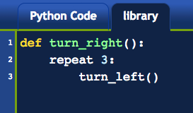
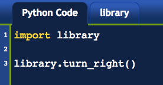
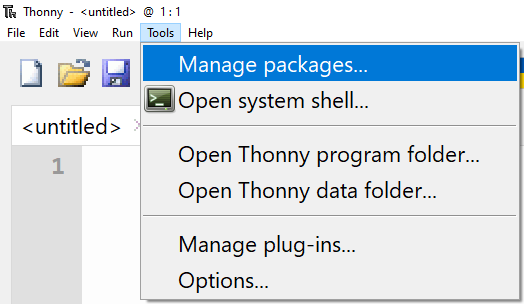

.. qnum::
   :prefix: other-input-methods-1
   :start: 1

Other Input Methods (appJar)
===============================

.. topic:: Quick Overview of Day

    Triple quoted strings can span multiple lines. Getting user input with a pop-up window using the appJar module. Work on a Python assignment, focused on input/output of strings, and conditionals.

.. reveal:: curriculum_addressed
    :showtitle: Curriculum Objectives Addressed In This Section

    - **CS20-CP1** Apply various problem-solving strategies to solve programming problems throughout Computer Science 20.
    - **CS20-FP1** Utilize different data types, including integer, floating point, Boolean and string, to solve programming problems.
    - **CS20-FP2** Investigate how control structures affect program flow.

What Does This Program Do?
---------------------------

.. note:: Your teacher may choose to use the following examples as a class activity, by displaying the  examples, and having you take a guess as to what you think each will do before running the code. 

What will the following programs output? Why?

Can you fix the error in the following program?

.. activecode:: wdtpd_other_input_methods_1
    :caption: Find and fix the error in this program!
    :nocodelens:

    song_quote = "Leonard Cohen, in his song "Anthem", sings "There is a crack in everything; That's how the light gets in.""

    print(song_quote)

.. activecode:: wdtpd_other_input_methods_2
    :caption: Find and fix the error in this program!
    :nocodelens:

    part_one = '''Leonard Cohen, in his song "Anthem", sings '''
    part_two = '''"There is a crack in everything; That's how the light gets in."'''

    print(part_one + part_two)

.. activecode:: wdtpd_other_input_methods_3
    :caption: What will this program print?
    :nocodelens:

    the_story = '''This is a really long story. There
    is so much to tell that it takes
    more than one line to say it all.'''

    print(the_story)

.. activecode:: wdtpd_other_input_methods_4
    :caption: What will this program print?
    :nocodelens:

    interesting_quotes = '''There's a lot of people who have said interesting things. Some fun quotes include:
    
    "What I cannot create, I do not understand." - Richard Feynman
    "Judge a man by his questions rather than by his answers." - Voltaire
    "Our ignorance of history causes us to slander our own times." - Gustave Flaubert'''

    print(interesting_quotes)

Getting User Input With appJar
----------------------------------

One of the great things about Thonny is how easy it is to add additional modules to the standard Python installation. You can think of a module as being similar to the **library** tab that we used in Reeborg. It gives us the ability to use extra functionality that another programmer has created. When we were programming Reeborg, we would often put functions into the library tab, like this:

In Reeborg, we would often import that code using ``from library import turn_right``, so that we could simply call the ``turn_right()`` function in the same way that we could call ``turn_left()``. However, it was also possible to import the library as follows:

You can think of this code as saying "Look into the ``library``, and find something called ``turn_right()``". For many Python modules, this is equivalent to saying, "Look into the library.py file, and find a function called turn_right()".

When using Python outside Reeborg, if you'd like to get user input through a graphical pop-up box instead of just through the console, we can just install a module ``appJar``. In Thonny, open *Tools -> Manage packages...*. 

Now type in ``appJar`` into the Search box (capitalization doesn't matter, but be sure to spell it *exactly*). Now click the Install button.

.. image:: images/thonny_add_appjar_module.png

You will now be able to use the appJar module in the same way you can use any other module. Here is a simple program that will use pop-up boxes to get the first and last names of the user, then print out the result to the console. If you'd like to learn how to do other things with this module, you can learn more about the `appJar module here <http://appjar.info/pythonDialogs/>`_

.. sourcecode:: python
    
    # import the library
    from appJar import gui

    # create a GUI (Graphical User Interface) instance called app
    app = gui()

    #spawn pop-up boxes
    #arguments are two strings (window_title, label_text)
    #think of this as, "look inside app, and call the textBox function"
    first_name = app.textBox("Name", "First Name?")
    last_name = app.textBox("Name", "Last Name?")

    #use concatenation to join the strings together
    print("Hello there, " + first_name + " " + last_name + "!")

.. note:: For Teachers: The line ``app = gui()`` creates an instance of the gui class (the class that you have imported from the appJar module), which you probably don't want to fully explain to students (as object oriented programming won't be discussed in this course at all). One possible way to give students a basic (though somewhat flawed) understanding of this is to say that calling ``from appJar import gui`` allows you to access a new data type called gui, so app is a variable of the data type gui. Variables of this new data type allow you to call special functions defined as part of that data type, such as ``textBox(window_title, label_text)``.

Assignment Work Time
---------------------

Please spend the rest of the class continuing to work on your current Python assignment (Madlib, or something similar). 

