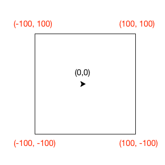

.. qnum::
   :prefix: logical-operators
   :start: 1

Logical Operators
===============================

.. topic:: Quick Overview of Day

    Introduce the logical operators ``and``, ``or``, ``not``. Work on practice problems, in which students create programs that utilize logical operators.

.. reveal:: curriculum_addressed
    :showtitle: Curriculum Outcomes Addressed In This Section

    - **CS20-CP1** Apply various problem-solving strategies to solve programming problems throughout Computer Science 20.
    - **CS20-FP1** Utilize different data types, including integer, floating point, Boolean and string, to solve programming problems.
    - **CS20-FP2** Investigate how control structures affect program flow.
    - **CS20-FP3** Construct and utilize functions to create reusable pieces of code.

``and``, ``or``, ``not``
----------------------------

There are three **logical operators**: ``and``, ``or``, and ``not``. The
semantics (meaning) of these operators is similar to their meaning in English.
For example, ``x > 0 and x < 10`` is true only if ``x`` is greater than 0 *and*
at the same time, x is less than 10.  How would you describe this in words?  You would say that x is between 0 and 10, not including the endpoints.

``n % 2 == 0 or n % 3 == 0`` is true if *either* of the conditions is true,
that is, if the number is divisible by 2 *or* divisible by 3.  In this case, one, or the other, or both of the parts has to be true for the result to be true.

Finally, the ``not`` operator negates a boolean expression, so ``not  x > y``
is true if ``x > y`` is false, that is, if ``x`` is less than or equal to
``y``.

.. activecode:: local_operators_example_1

    x = 5
    print(x > 0 and x < 10)

    n = 25
    print(n % 2 == 0 or n % 3 == 0)

.. caution:: Common Mistake!

    There is a very common mistake that occurs when programmers try to write boolean expressions.  For example, what if we have a variable ``number`` and we want to check to see if its value is 5,6, or 7.  In words we might say: "number equal to 5 or 6 or 7".  However, if we translate this into Python, ``number == 5 or 6 or 7``, it will not be correct.  The ``or`` operator must join the results of three equality checks.  The correct way to write this is ``number == 5 or number == 6 or number == 7``.  This may seem like a lot of typing but it is absolutely necessary.  You cannot take a shortcut.

Check Your Understanding
~~~~~~~~~~~~~~~~~~~~~~~~~

.. mchoice:: test_question6_2_1
   :answer_a: x &gt; 0 and &lt; 5
   :answer_b: x &gt; 0 or x &lt; 5
   :answer_c: x &gt; 0 and x &lt; 5
   :correct: c
   :feedback_a: Each comparison must be between exactly two values.  In this case the right-hand expression &lt; 5 lacks a value on its left.
   :feedback_b: Although this is legal Python syntax, the expression is incorrect.  It will evaluate to true for all numbers that are either greater than 0 or less than 5.  Because all numbers are either greater than 0 or less than 5, this expression will always be True.
   :feedback_c: Yes, with an and keyword both expressions must be true so the number must be greater than 0 an less than 5 for this expression to be true. Although most other programming languages do not allow this mathematical syntax, in Python, you could also write 0 &lt; x &lt; 5.

   What is a correct Python expression for checking to see if a number stored in a variable x is between 0 and 5?

Precedence of Operators
-----------------------

We have now added a number of additional operators to those we have learned.  It is important to understand how these operators relate to the others with respect to operator precedence.  Python will always evaluate the arithmetic operators first (** is highest, then multiplication/division, then addition/subtraction).  Next comes the relational operators.  Finally, the logical operators are done last.  This means that the expression ``x*5 >= 10 and y-6 <= 20`` will be evaluated so as to first perform the arithmetic and then check the relationships.  The ``and`` will be done last.  Although many programmers might place parenthesis around the two relational expressions, it is not necessary.

The following table summarizes the precedence discussed so far from highest to lowest.  

=======   ==============  ===============
Level     Category        Operators
=======   ==============  ===============
7(high)   exponent        \**
6         multiplication  \*, /, //, %
5         addition        +, -
4         relational      ==, !=, <=, >=, >, <
3         logical         not
2         logical         and
1(low)    logical         or
=======   ==============  ===============

Check Your Understanding
~~~~~~~~~~~~~~~~~~~~~~~~~

.. mchoice:: test_question6_3_1
   :answer_a: ((5*3) &gt; 10) and ((4+6) == 11)
   :answer_b: (5*(3 &gt; 10)) and (4 + (6 == 11))
   :answer_c: ((((5*3) &gt; 10) and 4)+6) == 11
   :answer_d: ((5*3) &gt; (10 and (4+6))) == 11
   :correct: a
   :feedback_a: Yes, * and + have higher precedence, followed by &gt; and ==, and then the keyword &quot;and&quot;
   :feedback_b: Arithmetic operators (*, +) have higher precedence than comparison operators (&gt;, ==)
   :feedback_c: This grouping assumes Python simply evaluates from left to right, which is incorrect.  It follows the precedence listed in the table in this section.
   :feedback_d: This grouping assumes that &quot;and&quot; has a higher precedence than ==, which is not true. 

   Which of the following properly expresses the precedence of operators (using parentheses) in the following expression: ``5*3 > 10 and 4+6==11``

Here is an animation for the above expression:

.. showeval:: se_tq631
   :trace_mode: true

   5 * 3 > 10 and 4 + 6 == 11
   ~~~~
   {{5 * 3}}{{15}} > 10 and 4 + 6 == 11
   {{15 > 10}}{{True}} and 4 + 6 == 11
   True and {{4 + 6}}{{10}} == 11
   True and {{10 == 11}}{{False}}
   {{True and False}}{{False}}

Practice Problems
------------------

Under 100
~~~~~~~~~~

Write a program that takes in a number from the user, and correctly prints either "That number is between 1 to 100" or "That number is not between 1 to 100". *You may only use a single if/else block to solve this problem*.

.. activecode:: under-100
    :nocodelens:

    # your code goes here!

From Saskatchewan
~~~~~~~~~~~~~~~~~~

Write a program that asks the user which province they live in. If the province isn't "saskatchewan", print out "You should come visit Saskatchewan sometime!". *You must use at least one logical operator in your solution*.

.. activecode:: from-saskatchewan
    :nocodelens:

    # your code goes here!

Divisible by 3 or 5
~~~~~~~~~~~~~~~~~~~~

Write a program that asks the user to enter a number. You should print out a message to the user, either "That number is divisible by either 3 or 5", or "That number is not divisible by either 3 or 5". *Be sure to consider the data type of the input you are taking in from the user. Use a single if/else block to solve this problem.*

.. activecode:: divisible-by-3-or-5
    :nocodelens:

    # your code goes here!

Turtle Stuck In a Square
~~~~~~~~~~~~~~~~~~~~~~~~~

You have been given some starter code for the problem below. **You only need to change one line of the code, specifically the line containing the while loop.** Replace the word ``something`` with the appropriate boolean questions that will cause the turtle to continue moving until it gets to one of the edges of the square. Each time the program is run, the turtle will pick a new random direction to move. When executed, your program should look something like this:

.. image:: images/stuck_in_square.gif

Note that you can get the current x coordinate of the turtle by calling ``bob.xcor()``, and the current y coordinate by calling ``bob.ycor()``. Also remember that the turtle begins at the origin (0, 0), which is in the center of the screen. The vertices of the square have x and y coordinates as shown below:

.. activecode:: turtle-stuck-in-square
    :nocodelens:

    import turtle
    import random

    canvas = turtle.Screen()

    bob = turtle.Turtle()

    # draw a square to represent the area the turtle needs to stay inside
    bob.speed(0) 
    bob.penup()
    bob.goto(-100, -100) # sends bob to a specific coordinate
    bob.pendown()
    for side in range(4):
        bob.forward(200)
        bob.left(90)
    bob.penup()

    # reset turtle to normal starting location
    bob.goto(0, 0)
    bob.speed(3)

    # pick random direction to move
    some_angle = random.randrange(1, 360)
    bob.setheading(some_angle)

    # complete the while statement below
    # you should only need to adjust one line of code (directly under this comment)
    while something:
        bob.forward(5)

.. not (bob.xcor() > 100 or bob.xcor() < -100 or bob.ycor() < -100 or bob.ycor() > 100)

Booleans Practice Quiz
-----------------------

To confirm you are feeling confident with booleans and logical operators, try to answer the following:

Question 1
-----------

.. mchoice:: booleans_practice_quiz_1
    :answer_a: True
    :answer_b: False
    :correct: a
    :feedback_a: Great!
    :feedback_b: Try again!

    What would the following print?::

        a = 6
        b = 10
        print(a == 6)

Question 2
-----------

.. mchoice:: booleans_practice_quiz_2
    :answer_a: True
    :answer_b: False
    :correct: a
    :feedback_a: Great!
    :feedback_b: Try again!

    What would the following print?::

        a = 6
        b = 10
        print( not (b == 6) )

Question 3
-----------

.. mchoice:: booleans_practice_quiz_3
    :answer_a: True
    :answer_b: False
    :correct: a
    :feedback_a: Great!
    :feedback_b: Try again!

    What would the following print?::

        a = 6
        b = 10
        print( a == 10 or b == 10 )

Question 4
-----------

.. mchoice:: booleans_practice_quiz_4
    :answer_a: True
    :answer_b: False
    :correct: a
    :feedback_a: Great!
    :feedback_b: Try again!

    What would the following print?::

        a = 6
        b = 10
        print( a == 6 and 10 )

Question 5
-----------

.. mchoice:: booleans_practice_quiz_5
    :answer_a: True
    :answer_b: False
    :correct: a
    :feedback_a: Great!
    :feedback_b: Try again!

    What would the following print?::

        a = 6
        b = 10
        print( not a == 10 and b == 10 )
      

Question 6
-----------

.. mchoice:: booleans_practice_quiz_6
    :answer_a: True
    :answer_b: False
    :correct: b
    :feedback_a: Try again!
    :feedback_b: Great!

    What would the following print?::

        a = 6
        b = 10
        print( a == 10 or not b == 10 )
      

Question 7
-----------

.. mchoice:: booleans_practice_quiz_7
    :answer_a: True
    :answer_b: False
    :correct: a
    :feedback_a: Great!
    :feedback_b: Try again!

    What would the following print?::

        a = 6
        b = 10
        print( a == 6 and (not a == 10) )

Question 8
-----------

.. mchoice:: booleans_practice_quiz_8
    :answer_a: True
    :answer_b: False
    :correct: b
    :feedback_a: Try again!
    :feedback_b: Great!

    What would the following print?::

        a = 6
        b = 10
        print( not ( not a == 10 or not b == 10) )
      

.. Day Name
.. ~~~~~~~~~~~~~~~~~~~~~

.. .. activecode:: day-name
..     :nocodelens:

..     Write a function that takes in a number from 0 to 6 as a parameter, and returns the name associated with that number. If something other than a number from 0 to 6 is passed in, the function should return None.

..     ``day_name(0) → "Sunday"``

..     ``day_name(4) → "Thursday"``
    
..     ``day_name(6) → "Saturday"``
..     ~~~~
..     def day_name(day_number):
..         return "Wednesday"

..     ====
..     from unittest.gui import TestCaseGui

..     class myTests(TestCaseGui):

..         def testOne(self):
..             self.assertEqual(day_name(0),"Sunday","day_name(0)")
..             self.assertEqual(day_name(1),"Monday","day_name(1)")
..             self.assertEqual(day_name(2),"Tuesday","day_name(2)")
..             self.assertEqual(day_name(3),"Wednesday","day_name(3)")
..             self.assertEqual(day_name(4),"Thursday","day_name(4)")
..             self.assertEqual(day_name(5),"Friday","day_name(5)")
..             self.assertEqual(day_name(6),"Saturday","day_name(6)")

..     myTests().main()

.. Day Number
.. ~~~~~~~~~~~~~~~~~~~~~

.. .. activecode:: day-number
..     :nocodelens:

..     Write a function that takes in the name of a day as a parameter, and returns the day number associated with that day. If something other than a number from 0 to 6 is passed in, the function should return None.

..     ``day_name(0) → "Sunday"``

..     ``day_name(4) → "Thursday"``
    
..     ``day_name(6) → "Saturday"``
..     ~~~~
..     def day_name(day_number):
..         return "Wednesday"

..     ====
..     from unittest.gui import TestCaseGui

..     class myTests(TestCaseGui):

..         def testOne(self):
..             self.assertEqual(day_name(0),"Sunday","day_name(0)")
..             self.assertEqual(day_name(1),"Monday","day_name(1)")
..             self.assertEqual(day_name(2),"Tuesday","day_name(2)")
..             self.assertEqual(day_name(3),"Wednesday","day_name(3)")
..             self.assertEqual(day_name(4),"Thursday","day_name(4)")
..             self.assertEqual(day_name(5),"Friday","day_name(5)")
..             self.assertEqual(day_name(6),"Saturday","day_name(6)")

..     myTests().main()
