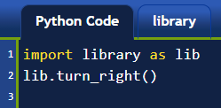

Other Input Methods (easygui_qt)
=================================

.. topic:: Quick Overview of Day

    Getting user input with a pop-up window using the easygui_qt module. Work on a Python assignment, focused on input/output of strings, and conditionals.

.. reveal:: curriculum_addressed
    :showtitle: Curriculum Outcomes Addressed In This Section

    - **CS20-CP1** Apply various problem-solving strategies to solve programming problems throughout Computer Science 20.
    - **CS20-FP1** Utilize different data types, including integer, floating point, Boolean and string, to solve programming problems.
    - **CS20-FP2** Investigate how control structures affect program flow.

What Does This Program Do?
---------------------------

.. note:: Your teacher may choose to use the following examples as a class activity, by displaying the  examples, and having you take a guess as to what you think each will do before running the code. 

What will the following programs output? Why?

Remember that a single equal sign ``=`` is used to **assign** a value. Two equal signs ``==`` are used when **comparing** a value.

Try the following code with ``x = 42``, ``x = 32``, ``x = 2``, ``x = 82``, and ``x = 142``.

.. activecode:: wdtpd_input_output_strings_1
    :caption: What will this program print?
    :nocodelens:

    x = 42
    if x < 10:
        x = x + 10
    elif x < 40:
        x = x + 5
    elif x < 70:
        x = x - 10
    elif x < 100:
        x = x - 5
    else:
        print("big number!")

    print(x)

.. activecode:: wdtpd_input_output_strings_2
    :caption: What will this program print?
    :nocodelens:

    age = input("How old are you?")
    print("Wow! Already " + age + " years old!")

Try the following, entering in ``17``. How about ``14``? Can you fix it? *Hint: think data types!*

.. activecode:: wdtpd_input_output_strings_3
    :caption: What will this program print?
    :nocodelens:

    age = input("How old are you?")
    if age > 15:
        print("Wow! Already " + age + " years old!")

Getting User Input With easygui_qt
-----------------------------------

One of the great things about Thonny is how easy it is to add additional modules to the standard Python installation. You can think of a module as being similar to the **library** tab that we used in Reeborg. It gives us the ability to use extra functionality that another programmer has created. When we were programming Reeborg, we would often put functions into the library tab, like this:

.. image:: images/reeborg_library.png

In Reeborg, we would often import that code using ``from library import turn_right``, so that we could simply call the ``turn_right()`` function in the same way that we could call ``turn_left()``. However, it was also possible to import the library as follows:

.. image:: images/reeborg_code_calling_library.png

You can think of this code as saying "Look into the ``library``, and find something called ``turn_right()``". For many Python modules, this is equivalent to saying, "Look into the library.py file, and find a function called turn_right()".

Another method of importing the library allows us give the module a nickname that is faster to type. Consider the following:

When using Python outside Reeborg, if you'd like to get user input through a graphical pop-up box instead of just through the console, we can just install a module ``cs20-easygui``. In Thonny, open *Tools -> Manage packages...*. 

.. image:: images/thonny_manage_packages_menu_item.png

Now type in ``cs20-easygui`` into the Search box (be sure to spell it *exactly*). Now click the Install button.

.. image:: images/thonny_add_easygui_module.png

.. note:: The ``cs20-easygui`` package attempts to install ``easygui_qt``, along with it's prerequisites. If you prefer (or if you run into installation problems), you can also just install each module on their own. The order you install them should be ``sip``, then ``PyQt5``, then ``easygui_qt``.

Get String From User
~~~~~~~~~~~~~~~~~~~~~~~~~

You will now be able to use the easygui_qt module in the same way you can use any other module. Here is a simple program that will use pop-up boxes to get the first and last names of the user, then print out the result to the console. 

.. sourcecode:: python
    
    # import the module to allow GUI interaction
    import easygui_qt as easy

    # think of this as "look inside easygui_qt, and run the get_string function
    first_name = easy.get_string("Please enter your first name")
    last_name = easy.get_string("Please enter your last name")

    greeting = "Hello there, " + first_name + " " + last_name + "!"
    print(greeting)

Display Graphical Message
~~~~~~~~~~~~~~~~~~~~~~~~~

If you would like to output the message to a graphical window (instead of the console), you can call the ``show_message()`` function, as shown below.

.. sourcecode:: python
    
    # import the module to allow GUI interaction
    import easygui_qt as easy

    # think of this as "look inside easygui_qt, and run the get_string function
    first_name = easy.get_string("Please enter your first name")
    last_name = easy.get_string("Please enter your last name")

    greeting = "Hello there, " + first_name + " " + last_name + "!"

    # can also display output graphically
    easy.show_message(greeting)

Get Choice From User
~~~~~~~~~~~~~~~~~~~~~~~~~

To give the user a list of options to choose from, we can create a **list** of all the choices they can choose from. Imagine that you were creating a program that would allow the user to select which school subject was their favourite. You might include a list of options, as follows:

.. sourcecode:: python

    # import the module to allow GUI interaction
    import easygui_qt as easy

    subjects = ["English", "Math", "Computer Science", "History", "Phys Ed"]

    # note that the values passed to the following function are Prompt, Window Title, and Choices
    favourite = easy.get_choice("What is your fav?", "Pick Subject", subjects)

    easy.show_message("Good call. " + favourite + " is good.")

You could take this a step further, doing something different depending on which subject the user selected. 

.. sourcecode:: python

    # import the module to allow GUI interaction
    import easygui_qt as easy

    subjects = ["English", "Math", "Computer Science", "History", "Phys Ed"]
    favourite = easy.get_choice("What is your fav?", "Pick Subject", subjects)

    if favourite == "English":
        easy.show_message("To be or not to be: that is the question.")
    elif favourite == "Math":
        easy.show_message("I'll take that as a good sine")
    elif favourite == "Computer Science":
        easy.show_message("Are you just saying that?")
    else:
        easy.show_message("Good call. " + favourite + " is good.")

Other Methods
~~~~~~~~~~~~~~~~~~~~~~~~~

There are many more things you can use easygui_qt for. For a complete list, see the `easygui_qt API <http://easygui-qt.readthedocs.io/en/latest/api.html>`_ (application programming interface) for reference. 

For quick reference, here are a few of them (assumes you have called ``import easygui_qt as easy``):

+-------------------------------------------------------------------------------------------+--------------------------------------------------------+
|                                          Function                                         |                    What it Returns                     |
+===========================================================================================+========================================================+
| ``easy.get_string("Some prompt/question:")``                                              | returns a string (or None if cancelled)                |
+-------------------------------------------------------------------------------------------+--------------------------------------------------------+
| ``easy.get_integer("Some prompt/question:")``                                             | returns an int (or None if cancelled)                  |
+-------------------------------------------------------------------------------------------+--------------------------------------------------------+
| ``easy.get_float("Some prompt/question:")``                                               | returns a float (or None if cancelled)                 |
+-------------------------------------------------------------------------------------------+--------------------------------------------------------+
| ``easy.get_yes_or_no("Some prompt/question:")``                                           | returns a ``True`` or ``False`` (or None if cancelled) |
+-------------------------------------------------------------------------------------------+--------------------------------------------------------+
| ``easy.show_message("Some message.")``                                                    | doesn't return anything                                |
+-------------------------------------------------------------------------------------------+--------------------------------------------------------+
| ``easy.show_text("A large chunk of text.")``                                              | doesn't return anything                                |
+-------------------------------------------------------------------------------------------+--------------------------------------------------------+

Two other functions that you might find useful (that require you to use lists) are:

-  ``easy.get_choice("Message to user", "Window Title", ["Some", "list", "of", "choices"])``, which returns a single choice from the list (or None if cancelled)
- ``easy.get_list_of_choices("Window title", ["Some", "list", "of", "choices"])``, which returns a list of selected items (or an empty list if cancelled)

.. note:: 

    In the examples given above, each of the functions above can take multiple arguments, as specified in the easygui_qt API. For example, you could call ``easy.get_string("Some prompt/question:", "Window Title", "Default response text")``. 

    Although investigating optional arguments in functions goes beyond the scope of CS20, you may find it useful to know that you can call the function with only some of the arguments. If you do this, however, you need to specify *which* argument you are passing, like 
    ``easy.get_string(message="Some prompt/question:", default_response="Default response text")``.

Assignment Work Time
---------------------

Please spend the rest of the class continuing to work on your current Python assignment (likely something emphasizing user input and output). 

