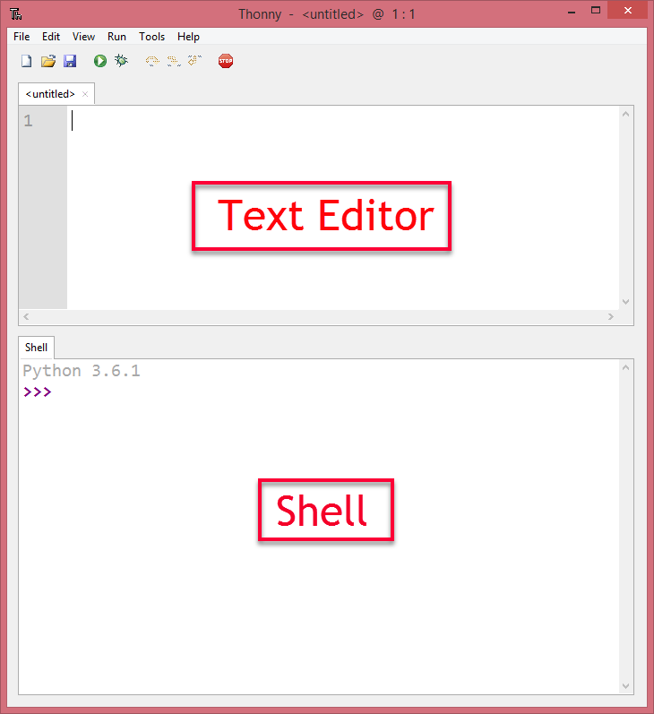

Quick Python Overview
==========================

.. note:: In today's quick exploration of Python, you will see some things that you do not understand. That is okay. We will go into each of the ideas in much more detail as the semester progresses, but it is really helpful to see a large overview before we get into the details of each section.

If you'd prefer to watch a video describing some important features of Python, `the following video <https://www.youtube.com/watch?v=d97kS830e-c>`_ demonstrates the same ideas as what I've described in text below.

.. youtube:: d97kS830e-c
    :height: 315
    :width: 560
    :align: left
    :http: https


What is Python?
---------------

Python is a programming language that lets you teach the computer to do what you want. You've already been writing Python programs using Reeborg. Everything you have already learned (with the exception of `repeat`), works in regular Python. Using regular Python allows us to start exploring other ways our programs can produce output, and take input.


Running Python on Your Computer
-------------------------------

There are many different ways to install Python on your computer (in fact, some version of Python might already be installed on your computer). However, one of the easiest ways to get Python working on your computer (Windows, Mac or Linux) is to `download Thonny <http://thonny.org/>`_. Go download Thonny now. It doesn't require administrative rights to install, so you should be able to install it in your school computer lab (double check with your teacher that they are okay with this first!). You may want to install Thonny at home as well. 

For each of the code segments that you see on this page, you can either run them directly in your web browser **OR** you can copy/paste the code into Thonny to run it. 

When using Thonny, you need to understand the difference between the **text editor** and the **shell** (also known as the interpreter). If you want to save your code to use again later, you should type your code into the text editor, which will prompt you to save your file somewhere on disk when you press the Run Current Script button (or press F5). The output of your code will show up in the shell (underneath the text editor). You can also type in any Python code you'd like into the shell, which is a handy way to try out new things in Python.




Whitespace
-----------

Just like when you were programming Reeborg, it is **really important to indent your code correctly** in Python. For example, the code given below will cause a **syntax error** when you click the Run button. Click the Run button to see the error. Now, can you figure out how to fix it? Edit the code, then click Run again to see if you've fixed it!

.. activecode:: syntax_error_indentation
    :caption: Fix the syntax error by indenting the code properly.
    :nocodelens:

    some_number = 5
    if some_number > 3:
    print("Yeah, the number is bigger.")


Printing Output
---------------

As you saw in the example above, you can ``print()`` things to standard output (usually the Python console/interpreter). The ``print()`` function will be used in many of the examples that follow. Note that ``print()`` can take any number of arguments, separated by commas. So you could print something like this: ``print("Monday", "Tuesday", "Wednesday")``, which would print ``Monday Tuesday Wednesday``, with each argument separated by a space.

.. note:: There are lots of other ways that a program can produce output, like drawing, turning on LEDs, etc. We will investigate some of these later in the course.


Variables and Data Types
------------------------

You hopefully remember using variables to keep track of things when we were using Scratch. For example, we used a variable called `number of sides` when we began to draw regular polygons. In Python, we can create variables as well. In the example above, we made a variable called `some_number`. We have to be careful how we name variables, since they can't be keywords like `if`, `not`, etc. A keyword is a word that already has a special meaning in Python. Variables should start with a letter, and if they contain more than one word, you should put an underscore between the words (like `helpful_variable` or `something_else`).

The fundamental data types that we are concerned about in Python include:

- **int** (integer, such as ``3`` or ``-5``)
- **float** (floating point number, such as ``1.2`` or ``-4.75``)
- **str** (string, such as ``"hello"`` or ``'Friday'`` or ``"5"``)
- **bool** (boolean, such as ``True`` or ``False``) 

We will use each of the data types given above throughout the course, and it is **really important** that you understand the differences between them. Take a moment now to try the following questions.

**Check Your Understanding**

.. mchoice:: data_types_1_1
    :answer_a: boolean
    :answer_b: integer
    :answer_c: float
    :answer_d: string
    :correct: d
    :feedback_a: It is not True or False.
    :feedback_b: The data is not numeric.
    :feedback_c: The value is not numeric with a decimal point.
    :feedback_d: Great! Strings are enclosed in quotes.

    What is the data type of ``'this is what kind of data'``?

.. mchoice:: data_types_1_2
    :answer_a: boolean
    :answer_b: integer
    :answer_c: float
    :answer_d: string
    :correct: b
    :feedback_a: It is not True or False.
    :feedback_b: Great! The data is numeric, without a decimal point.
    :feedback_c: The value is not numeric with a decimal point.
    :feedback_d: Strings are enclosed in quotes.

    What is the data type of ``3``?

.. mchoice:: data_types_1_3
    :answer_a: boolean
    :answer_b: integer
    :answer_c: float
    :answer_d: string
    :correct: a
    :feedback_a: Great! Boolean is either True or False.
    :feedback_b: The data is not numeric.
    :feedback_c: The value is not numeric with a decimal point.
    :feedback_d: Strings are enclosed in quotes.

    What is the data type of ``True``?
   
.. mchoice:: data_types_1_4
    :answer_a: boolean
    :answer_b: integer
    :answer_c: float
    :answer_d: string
    :correct: c
    :feedback_a: It is not True or False.
    :feedback_b: The data is not numeric.
    :feedback_c: Great! The value is numeric with a decimal point.
    :feedback_d: Strings are enclosed in quotes.

    What is the data type of ``1.5``?


Checking Data Types
-------------------

If you aren't sure what the data type of something is, you can check it using the ``type()`` function. This works on both values (a piece of data) and variables (a container that holds a value). What will the code below do? After you have pressed Run below, change the value inside the ``type()`` function to make sure you really understand what it is doing. Replace the ``5`` with ``5.3``. What do you get? How about ``"5.3"``?

.. activecode:: checking_data_types
    :nocodelens:

    print( type(5) )


.. _type_casting_functions:

Converting Between Data Types
-----------------------------

Sometimes you might need to convert from one data type to another. You can use the following functions to **type cast** data:

- ``str(x)`` to convert *x* to a string
- ``int(x)`` to convert *x* to an integer
- ``float(x)`` to convert *x* to a floating point number

.. activecode:: casting_data_types
    :nocodelens:

    a = 4         #a is an int
    print( type(a) )

    b = str(a)    #b is the string '4'
    print( type(b) )
   
    c = float(b)  #c is the float 4.0
    print( type(c) )
   

.. _math_operator_list:

Math Operators
--------------

We can do math with Python, but we need to know the operators to use. The following table shows the most frequently used math operators in Python.

=======   ==============================    ===============       ======
Symbols   Operations                        Example               Output
=======   ==============================    ===============       ======
\+        Addition                          ``1 + 2``             3
\-        Subtraction                       ``2 - 1``             1
\*        Multiplication                    ``2 * 2``             4
/         Division                          ``5 / 2``             2.5
//        Truncating Division (quotient)    ``5 // 2``            2
%         Modulo (remainder)                ``5 % 2``             1
\*\*       Power                            ``5 ** 2``            25
=======   ==============================    ===============       ======


``if``
----------------

The ``if`` control structure works the same way it did with Reeborg. Run the example given below. What happens if you change it to ``number = 23``. How about ``number = 10``? 

.. note:: A single equal sign ``=`` is used to **assign** a value. Two equal signs ``==`` are used when **comparing** a value.

.. activecode:: if_intro_1
    :nocodelens:
    
    number = 42

    if number == 42:
        print("So long and thanks for all the fish.")

    if number == 23:
        print("Michael Jordan is the GOAT (Greatest of All Time)")


``if/elif/else``
----------------

The ``if/elif/else`` control structure works in the exact same way it did when you were programming Reeborg. The important thing to remember is that **only one of the branches can execute**. Read the code below, and predict what you think the output will be. Then change it to ``temp = 25``. What will the output be now? How about if you change it to ``temp = 5``? What about ``temp = 15``?

.. activecode:: if_elif_else_intro
    :nocodelens:
    
    temp = -3

    if temp < -10:
        print("wear winter jacket")
    elif temp < 15:
        print("wear long sleeve shirt")
    else:
        print("wear t-shirt")


``while`` loop
--------------

Recall that we used a ``while`` loop in Reeborg when we didn't know the number of iterations ahead of time. In other words, the body of while will be repeated as long as the controlling boolean expression evaluates to ``True``. Run the code below. Can you change the code so that it counts **up** from 1 to 10, then says "Here I come!"?

.. activecode:: while_loop_intro
    :nocodelens:
    
    counter = 10

    while counter > 0:
        print(counter)
        counter = counter - 1   #decrease the counter each iteration

    print("Blastoff!")


``for`` loop
------------

When we knew the exact number of iterations required in Reeborg, we used the ``repeat`` command. That command was not part of regular Python -- it was added to keep Reeborg coding as simple as possible. Although I won't explain all the details about it yet, I will introduce you to the Python version of a repeat loop. If we want something to repeat 10 times, we could do the following: (after running the code, change the ``10`` to some other number and try it again)

.. activecode:: for_loop_intro_1
    :nocodelens:
    
    for counter in range(10):
        print(counter)

Notice that the loop above repeats 10 times, but begins counting at 0, so the last number is a 9. We can control the for loop even more by passing two arguments, like this:

.. activecode:: for_loop_intro_2
    :nocodelens:
    
    for counter in range(5, 11):
        print(counter)

One last version of the for loop that we will introduce allows us to go through a *list* of values, as follows. *Please note that there are a bunch of things in this example that you don't need to understand yet! We'll get there!*

.. activecode:: for_loop_intro_3
    :nocodelens:
    
    grocery_list = ["apples", "carrots", "milk", "yogurt"]
    for item in grocery_list:
        print("Don't forget to buy the", item)


Functions
----------

Just like you were able to teach Reeborg to do new things by creating a new function, we can create new functions in Python as well. Here are a couple examples:

.. activecode:: functions_intro_1
    :nocodelens:
    
    def say_hello():
        print("Hello there!")

    say_hello()


.. activecode:: functions_intro_2
    :nocodelens:
    
    def say_hello(some_name):
        print("Hello there,", some_name)

    say_hello("Eli")


Taking Input from User
-------------------------

If you want the user to type something, you can use the ``input()`` function. Here are a couple examples:

.. note:: ``input()`` will always return a string. You will need to convert it to an int or a float if you are expecting a number.


.. activecode:: input_intro_1
    :nocodelens:
    
    your_name = input("What is your name?")
    print(your_name)


.. activecode:: input_intro_2
    :nocodelens:
    
    def say_hello(some_name):
        print("Hello there, ", some_name)

    your_name = input("What is your name?")
    say_hello(your_name)


The following example is not going to work when you try to run it. Try entering in ``16``, then ``15``. Notice that nothing is printed either time, even though it looks like the conditional should be causing it to print. Can you figure out what is wrong and fix it? *Hint: think about data types!*

.. activecode:: input_intro_3
    :nocodelens:
    :caption: Can you figure out what is wrong?
    
    age = input("How old are you?")

    if age == 16:
        print("You can get your driver's license!")
    elif age == 15:
        print("You can get your learner driver's license.")


Python Modules
---------------

One of the great things about Python is that there are a lot of modules that extend the basic functionality of Python. A module is simply a file (or folder) containing Python functions and variables. You have created your own module when you were exploring Reeborg. When you typed ``from library import *```, you made all of the functions in the library tab available to your program. Please note that although we could use the ``from library import *`` syntax, it can cause problems if you accidentally create a function that has the same name as something you have imported. See the second example below for the recommended way to import. 

.. activecode:: module_intro_1
    :nocodelens:
    :caption: This works, but is not recommended.
    
    from math import *

    print( sqrt(16) )
    print( cos(0) )

.. activecode:: module_intro_2
    :nocodelens:
    :caption: This is the better way to import a module.
    
    import math

    print( math.sqrt(16) )
    print( math.cos(0) )

.. activecode:: module_intro_3
    :nocodelens:
    
    import random

    print( random.randint(1, 10) )


Number Guessing Game
--------------------

Remember the number guessing game we created in Scratch? The basic premise was as follows:

- generates a random number from 1 to 100 and stores it in a variable
- repeats the following until the user guesses the number
- gets the user to guess the number (using the **ask** block)
- tells the user if the number is too high or too low
- congratulates the user when they guess the correct number with a message such as "Way to go! You guessed the right number in 9 tries!"

We are going to try to implement this game in Python. **Please note: you will likely run into many problems trying to create this game in Python.** However, it can be really helpful to try problems that feel like they are above your skill level. Soon, you will be able to create programs like this on your own! Your teacher might choose to give you some time to try this on your own, then demonstrate a possible solution to the problem, or perhaps come back to this game in a couple of weeks.


.. activecode:: module_intro_3
    :caption: Create a number guessing game here!
    
    # the algorithm for the game can be described as follows
    # your job is to try to convert the comments into real Python code!

    # have the computer pick a random number between 1 to 100


    # create a variable to keep track of the number of guesses taken


    # set a variable with an initial value for the users guess, like this:
    user_guess = -1

    # repeat the following until the user guesses correctly

        # ask the user for their guess


        # update the number of guesses variable


        # if they guess high, tell them


        # if they guess low, tell them


    # congratulate the user, telling them how many guesses it took


