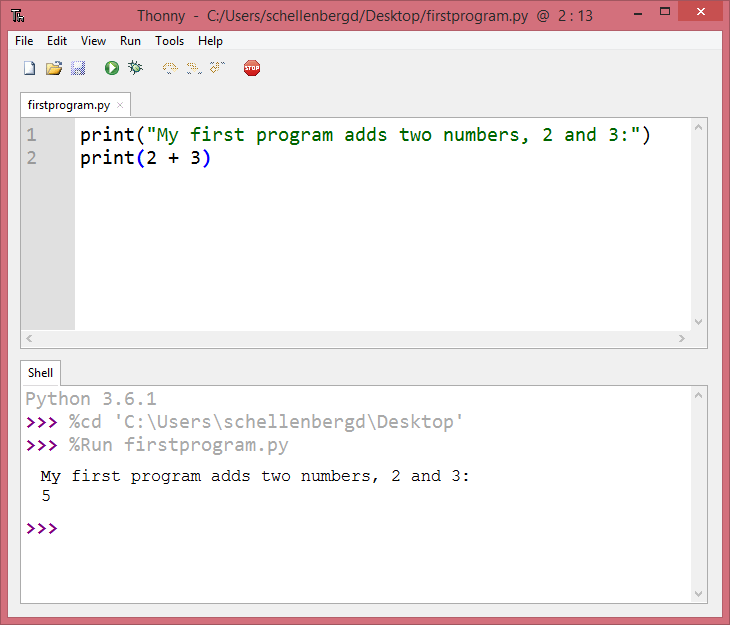

.. qnum::
   :prefix: python-variables
   :start: 1

Variables, Data Types, and User Input
======================================

.. topic:: Quick Overview of Day

    Give more details about variables. Reinforce the idea of data types. Practice some Python problems with simple input/output.

.. reveal:: curriculum_addressed
    :showtitle: Curriculum Outcomes Addressed In This Section

    - **CS20-CP1** Apply various problem-solving strategies to solve programming problems throughout Computer Science 20.
    - **CS20-FP1** Utilize different data types, including integer, floating point, Boolean and string, to solve programming problems.

What Does This Program Do?
---------------------------

Remember the we learned four primitive data types in our overview of Python. They are:

- ``int``
- ``float``
- ``string``
- ``bool``

.. note:: Your teacher may choose to use the following examples as a class activity, by displaying the  examples, and having you take a guess as to what you think each will do before running the code. 

For the following examples, consider the data type of each variable. What will the program output? Why?

.. activecode:: wdtpd_variable_assignment_1
    :caption: What will this program print?
    :nocodelens:

    x = 4
    y = 3 + x
    print(x + y)

.. activecode:: wdtpd_variable_assignment_3
    :caption: What will this program print?
    :nocodelens:

    x = 4
    y = 3
    z = "five"
    x = 2
    print(x + y)

.. activecode:: wdtpd_variable_assignment_2
    :caption: What will this program print?
    :nocodelens:

    x = 4
    y = 3
    z = "five"
    print(y + z)

Using Thonny
-------------

There are two ways to use Thonny: *shell mode* and *program
mode*. In shell mode, you type Python expressions into the **Python shell**,
and the interpreter immediately shows the result.  The example below shows the Python shell at work.

.. image:: images/thonny_shell.png

The ``>>>`` is called the **Python prompt**. The interpreter uses the prompt to
indicate that it is ready for instructions. We typed ``2 + 3``, then pressed Enter.  The
interpreter evaluated our expression and replied ``5``. On the next line
it gave a new prompt indicating that it is ready for more input.

Working directly in the interpreter is convenient for testing short bits of
code because you get immediate feedback. Think of it as scratch paper used to
help you work out problems.

Alternatively, you can write an entire program by placing lines of Python instructions
in a file and then use the interpreter to
execute the contents of the file as a whole. Such a file is often referred to as **source code**.  For
example, we used Thonny to create a source code file named ``firstprogram.py`` with
the following contents:

By convention, files that contain Python programs have names that end with
``.py`` .  Thonny will save your files with a .py extension automatically, and you should be able to open them in Thonny by double clicking them in File Explorer (or Finder).

.. note:: Notice that when we were using the **shell**, we didn't have to worry about using ``print()`` to see the value of a statement. The shell does that automatically. However, if we are using the **code editor**, we need to call **print()** any time we want to see output. 

**Check your understanding**

.. mchoice:: source_code_check
   :answer_a: the instructions in a program, stored in a file.
   :answer_b: the language that you are programming in (e.g., Python).
   :answer_c: the environment/tool in which you are programming.
   :answer_d: the number (or "code") that you must input at the top of each program to tell the computer how to execute your program.
   :correct: a
   :feedback_a: The file that contains the instructions written in the high level language is called the source code file.
   :feedback_b: This language is simply called the programming language, or simply the language.
   :feedback_c: The environment may be called the IDE, or integrated development environment, though not always.
   :feedback_d: There is no such number that you must type in at the start of your program.

   Source code is another name for:

.. index:: comments

Comments
--------

As programs get bigger and more complicated, they get more difficult to read.
Formal languages (e.g. programming languages) are dense, and it is often difficult to look at a piece of code and figure out what it is doing, or why.
For this reason, it is a good idea to add notes to your programs to explain in
natural language what the program is doing.  These notes are called comments.

A **comment** in a computer program is text that is intended only for the human
reader - it is completely ignored by the interpreter.
In Python, the ``#`` token starts a comment.  The rest of the line is ignored.
**Every program you write should start with a comment header**, which could look something like this:

.. activecode:: comment_header_example

    #---------------------------------------------------
    # First Python Program
    # Dan Schellenberg
    # Oct 16, 2017
    #---------------------------------------------------

    print("Hello, World!")

.. note:: Create a folder (call it Computer Science 20) on your computer to hold all of the code you will write in Python this semester. Save the file you created above as ``template.py``, and save it in that folder.

Notice that when you run this program, it only prints the phrase Hello, World!  None of the comments appear. You'll also notice that we've left a blank line in the program.  Blank lines
are also ignored by the interpreter, but comments and blank lines can make your
programs much easier for humans to parse.  Use them liberally!

**Check your understanding**

.. mchoice:: comment_check
   :answer_a: To tell the computer what you mean in your program.
   :answer_b: For the people who are reading your code to know, in natural language, what the program is doing.
   :answer_c: Nothing, they are extraneous information that is not needed.
   :answer_d: Nothing in a short program.  They are only needed for really large programs.
   :correct: b
   :feedback_a: Comments are ignored by the computer.
   :feedback_b: The computer ignores comments.  It's for the humans that will "consume" your program.
   :feedback_c: Comments can provide much needed information for anyone reading the program.
   :feedback_d: Even small programs benefit from comments.

   What are comments for?

.. index:: variables

Variables
---------

One of the most powerful features of a programming language is the ability to
manipulate **variables**. A variable is a name that refers to a value.

**Assignment statements** create new variables and also give them values to refer to.

.. sourcecode:: python

    message = "What's up, Doc?"
    n = 17
    pi = 3.14159

This example makes three assignments. The first assigns the string value
``"What's up, Doc?"`` to a new variable named ``message``. The second gives the
integer ``17`` to ``n``, and the third assigns the floating-point number
``3.14159`` to a variable called ``pi``.

The **assignment token**, ``=``, should not be confused with *equality* (we will see later that equality uses the
``==`` token).  The assignment statement links a *name*, on the left hand
side of the operator, with a *value*, on the right hand side.  This is why you
will get an error if you enter:

.. sourcecode:: python

    17 = n

.. tip::

   When reading or writing code, say to yourself "n is assigned 17" or "n gets
   the value 17" or "n is a reference to the object 17" or "n refers to the object 17".  Don't say "n equals 17".

A common way to represent variables on paper is to write the name with an arrow
pointing to the variable's value. This kind of figure, known as a **reference diagram**, is often called a **state
snapshot** because it shows what state each of the variables is in at a
particular instant in time.  (Think of it as the variable's state of mind).
This diagram shows the result of executing the assignment statements shown above.

.. image:: images/refdiagram1.png
   :alt: Reference Diagram

If you ask Python to evaluate a variable, it will produce the value
that is currently linked to the variable.  In other words, evaluating a variable will give you the value that is referred to
by the variable.

.. activecode:: variables_example_1
    :nocanvas:

    message = "What's up, Doc?"
    n = 17
    pi = 3.14159

    print(message)
    print(n)
    print(pi)

In each case the result is the value of the variable.

Variables also have types; again, we can ask the interpreter what they are.

.. activecode:: variables_example_2
    :nocanvas:

    message = "What's up, Doc?"
    n = 17
    pi = 3.14159

    print(type(message))
    print(type(n))
    print(type(pi))

The type of a variable is the type of the object it currently refers to.

We use variables in a program to "remember" things, like the current score at
the basketball game.  But variables are *variable*. This means they can change
over time, just like the scoreboard at a basketball game.  You can assign a value
to a variable, and later assign a different value to the same variable.

.. note::

    This is different from math. In math, if you give ``x`` the value 3, it
    cannot change to refer to a different value half-way through your
    calculations!

To see this, read and then run the following program.
You'll notice we change the value of ``day`` three times, and on the third
assignment we even give it a value that is of a different type.

.. codelens:: variables_example_3
    :showoutput:

    day = "Thursday"
    print(day)
    day = "Friday"
    print(day)
    day = 21
    print(day)

**Check your understanding**

.. mchoice:: variables_check_1
   :answer_a: Nothing is printed. A runtime error occurs.
   :answer_b: Thursday
   :answer_c: 32.5
   :answer_d: 19
   :correct: d
   :feedback_a: It is legal to change the type of data that a variable holds in Python.
   :feedback_b: This is the first value assigned to the variable day, but the next statements reassign that variable to new values.
   :feedback_c: This is the second value assigned to the variable day, but the next statement reassigns that variable to a new value.
   :feedback_d: The variable day will contain the last value assigned to it when it is printed.

   What is printed when the following statements execute?

   .. code-block:: python

     day = "Thursday"
     day = 32.5
     day = 19
     print(day)

.. index:: variable names

Variable Names and Keywords
---------------------------

**Variable names** can be arbitrarily long. They can contain both letters and
digits, but they have to begin with a letter or an underscore. You should use long, descriptive variable names. For example, if you were creating a program to calculate how much gas a car uses, a good variable name might be ``litres_per_100_kms``. A bad variable name in that case would be ``l``. Using a single letter as the variable name usually makes your program harder to understand for other people. Although that can be a bit annoying to type out a long variable name the first time, once you have typed it once in Thonny, you should be able to simply type the first few letters of the variable name, then press **Ctrl-Space** to have the rest of the variable name auto-complete for you. *If that doesn't work for you, check Thonny's preferences.*

The underscore character ( ``_``) can also appear in a name. It is often used in
names with multiple words, such as ``my_name`` or ``price_of_tea_in_china``. **This is the preferred way to write long variable names in Python, and you should use this style!**

.. caution::

   Variable names can never contain spaces.

There are some situations in which names beginning with an underscore have
special meaning, so a safe rule for beginners is to start all names with a
letter.

Although it is legal to use uppercase letters, by convention we don't. If you choose to use uppercase letters, remember that case matters. ``Bruce`` and ``bruce`` are different variables.

.. note:: Conventions about variable names differ from one language to another. Another common variable naming pattern is to use a lowercase letter for the first word, and to capitalize the starting letter of each word that follows. For example, you might use ``myName`` or ``priceOfTeaInChina``. This is often called camelCaps (think of the humps of a camel). 

If you give a variable an illegal name, you get a syntax error.  In the example below, each
of the variable names is illegal.

::

    76trombones = "big parade"
    more$ = 1000000
    class = "Computer Science 101"

``76trombones`` is illegal because it does not begin with a letter.  ``more$``
is illegal because it contains an illegal character, the dollar sign. But
what's wrong with ``class``?

.. index:: Python keywords

It turns out that ``class`` is one of the Python **keywords**. Keywords define
the language's syntax rules and structure, and they cannot be used as variable
names.
Python has thirty-something keywords (and every now and again improvements to
Python introduce or eliminate one or two):

======== ======== ======== ======== ======== ========
and      as       assert   break    class    continue
def      del      elif     else     except   exec
finally  for      from     global   if       import
in       is       lambda   nonlocal not      or
pass     raise    return   try      while    with
yield    True     False    None
======== ======== ======== ======== ======== ========

You might want to keep this list handy. If the interpreter complains about one
of your variable names and you don't know why, see if it is on this list.

**Programmers generally choose names for their variables that are meaningful to
the human readers of the program --- they help the programmer document, or
remember, what the variable is used for.**

User Input
-------------

If you want the user to type something, you can use the ``input()`` function. ``input()`` will **always return a string**. You will need to convert it to an int or a float if you are expecting a number.

.. activecode:: input_demo_1
    :nocodelens:
    
    your_school = input("What school do you attend?")
    print(your_school)

The following example is not going to work when you try to run it. Can you figure out what is wrong and fix it? *Hint: think about data types!*

.. activecode:: input_demo_2
    :nocodelens:
    
    current_year = input("What is the current year?")
    grad_year = input("What year will you graduate from high school?")

    year_difference = grad_year - current_year

    print("You will graduate in", year_difference, "years.")

**Do not look** at this sample solution unless you have spent time attempting to create your own solution!

.. reveal:: reveal_solution_input_demo_2
    :showtitle: Reveal Solution
    :hidetitle: Hide Solution

    This is one possible solution::

        current_year = input("What is the current year?")
        grad_year = input("What year will you graduate from high school?")

        # convert user input to be integers, so we can subtract
        current_year = int(current_year)
        grad_year = int(grad_year)

        year_difference = grad_year - current_year

        print("You will graduate in", year_difference, "years.")

Practice Problems
------------------

Try the following practice problems. Be sure that you know how to do the question with paper/pencil before you attempt to write a solution in Python! You can either work directly in the textbook, or using Thonny. Either way, be sure to save your solution into your Computer Science 20 folder when you finish!

.. note:: Remember that every time you take ``input()`` from the user, the data type of that input will be a string! You might want to look back at :ref:`type_casting_functions`.

Area of a Circle
~~~~~~~~~~~~~~~~

Write a program that will compute the area of a circle.  Prompt the user to enter the radius and print a nice message back to the user with the answer.
   
.. activecode:: practice_problem_variables_data_types_1
    :nocodelens:
    :enabledownload:

    # Area of a Circle Calculator
    # Put Your Name Here
    # Put the Date Here

    # your code goes here

**Do not look** at this sample solution unless you have already finished creating your own solution!

.. reveal:: reveal_solution_practice_problem_variables_data_types_1
    :showtitle: Reveal Solution
    :hidetitle: Hide Solution

    This is one possible solution::

        # Area of a Circle Calculator
        # Dan Schellenberg
        # Oct 18, 2017

        pi = 3.14

        radius = input("Please enter the radius: ")
        radius = float(radius)  #convert input into a number

        area = pi*radius**2

        print("The area of the circle is", area)

Area of a Rectangle
~~~~~~~~~~~~~~~~~~~

Write a program that will compute the area of a rectangle.  Prompt the user to enter the width and height of the rectangle. Print a nice message with the answer.
   
.. activecode:: practice_problem_variables_data_types_2
    :nocodelens:
    :enabledownload:

    # Area of a Rectangle Calculator
    # Put Your Name Here
    # Put the Date Here

    # your code goes here

**Do not look** at this sample solution unless you have already finished creating your own solution!

.. reveal:: reveal_solution_practice_problem_variables_data_types_2
    :showtitle: Reveal Solution
    :hidetitle: Hide Solution

    This is one possible solution::

        # Area of a Rectangle Calculator
        # Dan Schellenberg
        # Oct 19, 2017

        length = input("Enter the length of the rectangle: ")
        width = input("Enter the width of the rectangle: ")

        #convert user input into numbers
        length = float(length)
        width = float(width)

        area = length * width
        print("The area of the rectangle is", area)

Car Gas Usage
~~~~~~~~~~~~~

Write a program that will compute the Litres per Kilometers (l/100km) that a car uses. Promp the user to enter the number of kilometers driven, and the number of litres used. Print a nice message with the answer in liters/100kms. *Note: If you aren't sure how to calculate L/100km, you should try to calculate it by hand before writing a program. To help you check your work, if you drove 500km, and used 35L of gas, you should calculate using 7 L/100km*.

.. activecode:: practice_problem_variables_data_types_3
    :nocodelens:
    :enabledownload:

    # Gas Mileage Calculator
    # Put Your Name Here
    # Put the Date Here

    # your code goes here

**Do not look** at this sample solution unless you have already finished creating your own solution!

.. reveal:: reveal_solution_practice_problem_variables_data_types_3
    :showtitle: Reveal Solution
    :hidetitle: Hide Solution

    This is one possible solution::

        # Gas Mileage Calculator
        # Dan Schellenberg
        # Oct 19, 2017

        kilometers_driven = input("How many kilometers did you drive? ")
        litres_used = input("How many litres of gas did it take? ")

        #convert user input to numbers
        kilometers_driven = float(kilometers_driven)
        litres_used = float(litres_used)

        gas_usage = litres_used / kilometers_driven * 100

        print("Your car is using", gas_usage, "L/100km")

If You Finish Early
~~~~~~~~~~~~~~~~~~~~

If you completed all the questions above before the end of class, you might want to try one of the following extra challenges:

- making a calculator for a more complicated math problem. 
- you look at the clock and it is exactly 2pm. You set an alarm to go off in 51 hours. At what time does the alarm go off? Write a Python program to solve the general version of this problem. Ask the user for the time now (in hours), and ask for the number of hours to wait. Your program should output what the time will be on the clock when the alarm goes off. Note: You might want to look back at :ref:`math_operator_list`.

