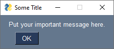
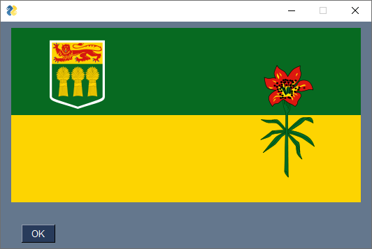

.. qnum::
   :prefix: pysimplegui-reference
   :start: 1

.. _pysimplegui_reference:

PySimpleGUI Reference
======================

PySimpleGUI is a full fledged way to create GUIs (Graphical User Interfaces) for your Python programs. The following reference covers a very small subset of the functions that PySimpleGUI offers, so you may want to read the `official docs of the  project <https://www.pysimplegui.org/en/latest/>`_ if you would like to explore more usage options. I have chosen to use just a few of the features of PySimpleGUI, particularly those that are more accessible to a student at the CS20 level. Most of what I explain below are called `popups <https://www.pysimplegui.org/en/latest/#high-level-api-calls-popups>`_ in PySimpleGUI parlance, which are one time use windows to collect or display information. If you do explore/teach more of the PySimpleGUI module with students, the ideas that you'll want to talk about will include returning multiple values from functions, two dimensional lists, try/except structures, and possibly dictionaries.

Installation
-------------

In Thonny, open Tools → Manage Packages and type in ``PySimpleGUI`` into the search bar. Click on the underlined ``PySimpleGUI`` module in the list of results, then click Install. 

Showing Messages
-----------------

If you call ``popup`` with a single argument, that argument should be a string containing the message you would like to show.

.. sourcecode:: python
    
    import PySimpleGUI as sg
    sg.popup("Enter your message as a string here, or pass in a variable containing a string.")

**Additional Options**

When you call a function such as ``sg.popup`` in Thonny (or another IDE), you will see a list of possible arguments that you can pass to the function, as seen below:

To use these additional arguments, you need to name them when calling the function. For example, if you call ``popup`` with a named argument of ``title = "something"``, the value passed into the ``title`` variable will be interpreted as the title the pop up window should have.

.. sourcecode:: python
    
    import PySimpleGUI as sg
    sg.popup("Put your important message here.", title = "Some Title")

Showing Images
-----------------

If you would like to show an image in a popup dialogue box, you use a named argument of ``image = "path-to-image.png"``. For example, if you have the image of the Saskatchewan flag saved as the file ``skflag.png`` saved in the same folder as your Python script, you could display the flag by calling the following:

.. sourcecode:: python
    
    import PySimpleGUI as sg
    sg.popup(image = "skflag.png")

Getting Strings
----------------

To create a pop up window that prompts the user to enter a string, use the ``popup_get_text`` function. This function will return whatever the user types in (as a string). If the user presses *Cancel*, or closes the window, this function will return ``None``.

.. sourcecode:: python
    
    import PySimpleGUI as sg
    answer = sg.popup_get_text("What is your name?")

.. image:: images/getting-strings1.png

**Additional Options**

If you call ``popup_get_text`` with a named argument of ``title = "something"``, the value passed into the ``title`` variable will be interpreted as the title the pop up window should have.

.. sourcecode:: python
    
    import PySimpleGUI as sg
    answer = sg.popup_get_text("What is your name?", title = "Name")

.. image:: images/getting-strings2.png

If you call ``popup_get_text`` with a named argument of ``default_text = "something"``, the value passed into the ``default_text`` variable will be interpreted as the default value to display inside the input box.

.. sourcecode:: python
    
    import PySimpleGUI as sg
    answer = sg.popup_get_text("What is your name?", title = "Name", default_text = "John Doe")

Getting Selection from a List
--------------------------------------

There is not a built-in popup function to create a window that prompts the user to select an option from a list. To get around this limitation, you can simply copy-paste the following ``popup_get_choice`` helper function to the top of your script, and use it to allow users to choose from a list of options. This function will return a string containing the user's choice. If the user presses *Cancel*, or closes the window, this function will return ``None``. If you would like to alter this function to suit your needs, you will want to look up the ``Listbox`` element in the PySimpleGUI reference.

.. sourcecode:: python
    
    import PySimpleGUI as sg

    def popup_get_choice(options, title = "Make a Choice"):
        '''Use this function to allow users to select an option from a list.
        Pass in the options to choose from as a list.'''
        layout = [[sg.Listbox(options, size=(30, None), key="-LISTBOX-")],
                  [sg.Button('Ok'), sg.Button('Cancel')]]
        event, values = sg.Window(title, layout).read(close=True)

        if event == "Ok":
            try:
                return values["-LISTBOX-"][0]
            except:
                return None
        else:
            return None

    # Use something similar to the following when using the popup_get_choice function
    subjects = ["English", "Math", "Computer Science", "History", "Phys Ed"]
    favourite = popup_get_choice(subjects)

.. image:: images/getting-choice.png

Getting A Yes/No Answer
------------------------

To create a pop up window that prompts the user to answer either Yes or No, use the ``popup_yes_no`` function. This function will return the string ``"Yes"`` if they clicked Yes, and the string ``"No"`` if they clicked No. If the user closes the window, this function will return ``None``.

.. sourcecode:: python
    
    import PySimpleGUI as sg
    reply = sg.popup_yes_no("Do you want to fight the monster?")

**Additional Options**

If you call ``popup_yes_no`` with a named argument of ``title = "something"``, the value passed into the ``title`` variable will be interpreted as the title the pop up window should have.

.. sourcecode:: python
    
    import PySimpleGUI as sg
    reply = sg.popup_yes_no("Do you want to fight the monster?", title = "Fight?")

Get File Name Path
--------------------

To create a pop up window that prompts the user to select a file from their computer, use the ``popup_get_file`` function. This function will return a string containing the full path to the file they selected. If the user presses *Cancel*, or closes the window, this function will return ``None``.

.. sourcecode:: python
    
    import PySimpleGUI as sg
    selected_image = sg.popup_get_file("Select image file:")

**Additional Options**

If you call ``popup_get_file`` with a named argument of ``title = "something"``, the value passed into the ``title`` variable will be interpreted as the title the pop up window should have.

.. sourcecode:: python
    
    import PySimpleGUI as sg
    selected_image = sg.popup_get_file("Select image file:", title = "Image")

Display Large Amounts of Text
------------------------------

To create a pop up window that shows large amounts of text, use the ``popup_scrolled`` function.

The easiest way to create a multiline string is to use triple quoted strings, as shown in the demo below. 

.. sourcecode:: python
    
    import PySimpleGUI as sg

    poem = '''Two roads diverged in a yellow wood,
    And sorry I could not travel both
    And be one traveler, long I stood
    And looked down one as far as I could
    To where it bent in the undergrowth;

    Then took the other, as just as fair,
    And having perhaps the better claim,
    Because it was grassy and wanted wear;
    Though as for that the passing there
    Had worn them really about the same,

    And both that morning equally lay
    In leaves no step had trodden black.
    Oh, I kept the first for another day!
    Yet knowing how way leads on to way,
    I doubted if I should ever come back.

    I shall be telling this with a sigh
    Somewhere ages and ages hence:
    Two roads diverged in a wood, and I—
    I took the one less traveled by,
    And that has made all the difference.'''

    sg.popup_scrolled(poem)

.. image:: images/scrolled-output1.png

**Additional Options**

If you call ``popup_scrolled`` with a named argument of ``title = "something"``, the value passed into the ``title`` variable will be interpreted as the title the pop up window should have.

.. sourcecode:: python
    
    import PySimpleGUI as sg

    poem = '''Two roads diverged in a yellow wood,
    And sorry I could not travel both
    And be one traveler, long I stood
    And looked down one as far as I could
    To where it bent in the undergrowth;

    Then took the other, as just as fair,
    And having perhaps the better claim,
    Because it was grassy and wanted wear;
    Though as for that the passing there
    Had worn them really about the same,

    And both that morning equally lay
    In leaves no step had trodden black.
    Oh, I kept the first for another day!
    Yet knowing how way leads on to way,
    I doubted if I should ever come back.

    I shall be telling this with a sigh
    Somewhere ages and ages hence:
    Two roads diverged in a wood, and I—
    I took the one less traveled by,
    And that has made all the difference.'''

    sg.popup_scrolled(poem, title = "Robert Frost Poem")

Creating More Complicated Layouts
----------------------------------

Creating full GUI interfaces goes beyond the scope of this reference, but if you are interested in going beyond the simple ``popup`` functions, you should know that PySimpleGUI creates layouts as a list of lists. Each list is one horizontal row of the window that will be created. 

In the example below, there are a few ideas that won't be explicitly taught in CS20. Specifically, returning multiple values from the ``window.read()`` function is not shown in the textbook. The ``values`` variable uses the `dictionary data type <https://docs.python.org/3/tutorial/datastructures.html#dictionaries>`_, which is not shown throughout the textbook.

.. sourcecode:: python
    
    import PySimpleGUI as sg

    layout = [[sg.Text("Saskatchewan Flag")],
              [sg.Image("skflag.png")],
              [sg.Text("Which colour in the flag is your favorite?")],
              [sg.InputText(key = "colour")],
              [sg.OK(), sg.Cancel()]]

    window = sg.Window("Flag", layout)

    event, values = window.read()
    window.close()

    your_color = values["colour"]
    sg.popup(f"{your_color} is a good choice!")

.. image:: images/custom-gui.png
