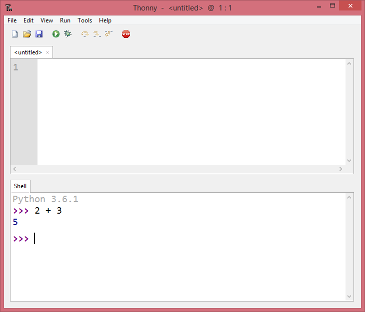

.. qnum::
   :prefix: intro-1
   :start: 1

Getting Started and Data Types Review
=======================================

.. topic:: Quick Overview of Day

    Reinforce the idea of data types. More information about the Python language. Demonstrate how to create a comment header at the top of programs. Give more information regarding variables (assigning values and comparing to values). 

.. reveal:: curriculum_addressed
    :showtitle: Curriculum Objectives Addressed In This Section

    - **CS20-CP1** Apply various problem-solving strategies to solve programming problems throughout Computer Science 20.
    - **CS20-FP1** Utilize different data types, including integer, floating point, Boolean and string, to solve programming problems.
    - **CS20-FP2** Investigate how control structures affect program flow.

What Does This Program Do?
---------------------------

Remember the we learned four primitive data types in our overview of Python. They are:

- ``int``
- ``float``
- ``string``
- ``bool``

.. note:: Your teacher may choose to use the following examples as a class activity, by displaying the  examples, and having you take a guess as to what you think each will do. 

For the following examples, consider the data type of each variable. What will the program output? Why?

.. activecode:: wdtpd_variable_assignment_1
    :caption: What will this program print?
    :nocodelens:

    x = 4
    y = 3 + x
    print(x + y)

.. activecode:: wdtpd_variable_assignment_2
    :caption: What will this program print?
    :nocodelens:

    x = 4
    y = 3
    z = "five"
    print(y + z)

.. activecode:: wdtpd_variable_assignment_3
    :caption: What will this program print?
    :nocodelens:

    x = 4
    y = 3
    z = "five"
    print(str(y) + z)

.. activecode:: wdtpd_variable_assignment_4
    :caption: What will this program print?
    :nocodelens:

    x = 4
    y = 3
    z = "five"
    print(str(y) + str(x))

The Python Programming Language
-------------------------------

Python is an example of a **high-level language**; other high-level languages you might have heard of are C++, PHP, and Java.

As you might infer from the name high-level language, there are also **low-level languages**, sometimes referred to as machine languages or assembly languages. Machine language is the encoding of instructions in binary so that they can be directly executed by the computer.  Assembly language uses a slightly easier format to refer to the low level instructions. Loosely speaking, computers can only execute programs written in low-level languages.  To be exact, computers can actually only execute programs written in machine language. Thus, programs written in a high-level language (and even those in assembly language) have to be processed before they can run. This extra processing takes some time, which is a small disadvantage of high-level languages. However, the advantages to high-level languages are enormous.

First, it is much easier to program in a
high-level language. Programs written in a high-level language take less time
to write, they are shorter and easier to read, and they are more likely to be
correct. Second, high-level languages are **portable**, meaning that they can
run on different kinds of computers with few or no modifications. Low-level
programs can run on only one kind of computer and have to be rewritten to run
on another.

Due to these advantages, almost all programs are written in high-level
languages. Low-level languages are used only for a few specialized
applications.

Two kinds of programs process high-level languages into low-level languages:
**interpreters** and **compilers**. An interpreter reads a high-level program
and executes it, meaning that it does what the program says. It processes the
program a little at a time, alternately reading lines and performing
computations.

.. image:: images/interpret.png
   :alt: Interpret illustration

A compiler reads the program and translates it completely before the program
starts running. In this case, the high-level program is called the **source
code**, and the translated program is called the **object code** or the
**executable**. Once a program is compiled, you can execute it repeatedly
without further translation.

.. image:: images/compile.png
   :alt: Compile illustration

Many modern languages use both processes. They are first compiled into a lower
level language, called **byte code**, and then interpreted by a program called
a **virtual machine**. Python uses both processes, but because of the way
programmers interact with it, it is usually considered an interpreted language.

There are two ways to use the Python interpreter: *shell mode* and *program
mode*. In shell mode, you type Python expressions into the **Python shell**,
and the interpreter immediately shows the result.  The example below shows the Python shell at work.

The ``>>>`` is called the **Python prompt**. The interpreter uses the prompt to
indicate that it is ready for instructions. We typed ``2 + 3``, then pressed Enter.  The
interpreter evaluated our expression and replied ``5``. On the next line
it gave a new prompt indicating that it is ready for more input.

Working directly in the interpreter is convenient for testing short bits of
code because you get immediate feedback. Think of it as scratch paper used to
help you work out problems.

Alternatively, you can write an entire program by placing lines of Python instructions
in a file and then use the interpreter to
execute the contents of the file as a whole. Such a file is often referred to as **source code**.  For
example, we used a Thonny to create a source code file named ``firstprogram.py`` with
the following contents:

.. image:: images/thonny_editor.png

By convention, files that contain Python programs have names that end with
``.py`` .  Following this convention will help your operating system and other
programs identify a file as containing python code.

.. note:: Notice that when we were using the **shell**, we didn't have to worry about ``print()``ing the value of a statement. The shell does that automatically. However, if we are using the **code editor**, we need to call **print()** any time we want to see output. 

**Check your understanding**

.. mchoice:: question1_2_1
   :answer_a: the instructions in a program, stored in a file.
   :answer_b: the language that you are programming in (e.g., Python).
   :answer_c: the environment/tool in which you are programming.
   :answer_d: the number (or "code") that you must input at the top of each program to tell the computer how to execute your program.
   :correct: a
   :feedback_a: The file that contains the instructions written in the high level language is called the source code file.
   :feedback_b: This language is simply called the programming language, or simply the language.
   :feedback_c: The environment may be called the IDE, or integrated development environment, though not always.
   :feedback_d: There is no such number that you must type in at the start of your program.

   Source code is another name for:

.. mchoice:: question1_2_2
   :answer_a: It is high-level if you are standing and low-level if you are sitting.
   :answer_b: It is high-level if you are programming for a computer and low-level if you are programming for a phone or mobile device.
   :answer_c: It is high-level if the program must be processed before it can run, and low-level if the computer can execute it without additional processing.
   :answer_d: It is high-level if it easy to program in and is very short; it is low-level if it is really hard to program in and the programs are really long.
   :correct: c
   :feedback_a: In this case high and low have nothing to do with altitude.
   :feedback_b: High and low have nothing to do with the type of device you are programming for.  Instead, look at what it takes to run the program written in the language.
   :feedback_c: Python is a high level language but must be interpreted into machine code (binary) before it can be executed.
   :feedback_d: While it is true that it is generally easier to program in a high-level language and programs written in a high-level language are usually shorter, this is not always the case.

    What is the difference between a high-level programming language and a low-level programming language?

Comments
--------

As programs get bigger and more complicated, they get more difficult to read.
Formal languages (e.g. programming languages) are dense, and it is often difficult to look at a piece of
code and figure out what it is doing, or why.
For this reason, it is a good idea to add notes to your programs to explain in
natural language what the program is doing.  These notes are called comments.

A **comment** in a computer program is text that is intended only for the human
reader - it is completely ignored by the interpreter.
In Python, the ``#`` token starts a comment.  The rest of the line is ignored.
Every program you write should start with a comment header, which could look something like this:

.. activecode:: ch01_3

    #---------------------------------------------------
    # First Python Program
    # Dan Schellenberg
    # Oct 16, 2017
    #---------------------------------------------------

    print("Hello, World!")

.. note:: Create a folder (call it Computer Science 20) on your computer to hold all of the code you will write in Python this semester. Save the file you created above as ``hello_world.py``, and save it in that folder.

Notice that when you run this program, it  only prints the phrase Hello, World!  None of the comments appear. You'll also notice that we've left a blank line in the program.  Blank lines
are also ignored by the interpreter, but comments and blank lines can make your
programs much easier for humans to parse.  Use them liberally!

**Check your understanding**

.. mchoice:: question1_12_1
   :answer_a: To tell the computer what you mean in your program.
   :answer_b: For the people who are reading your code to know, in natural language, what the program is doing.
   :answer_c: Nothing, they are extraneous information that is not needed.
   :answer_d: Nothing in a short program.  They are only needed for really large programs.
   :correct: b
   :feedback_a: Comments are ignored by the computer.
   :feedback_b: The computer ignores comments.  It's for the humans that will "consume" your program.
   :feedback_c: Comments can provide much needed information for anyone reading the program.
   :feedback_d: Even small programs benefit from comments.

   What are comments for?

