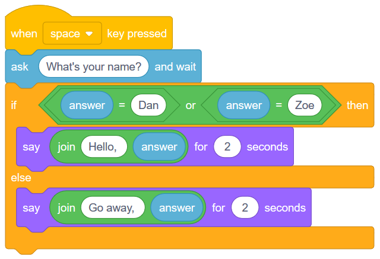

Built-In Variables (Tempo, Answer and Timer)
============================================

.. topic:: Quick Overview of Day

    Explore some of the built-in variables available in Scratch, including **tempo**, **answer** and **timer**. Introduce the **join** operator to concatenate strings, and the **abs** operator to calculate the absolute value of a number.

.. reveal:: curriculum_addressed
    :showtitle: Curriculum Outcomes Addressed In This Section

    - **CS20-CP1** Apply various problem-solving strategies to solve programming problems throughout Computer Science 20.
    - **CS20-FP1** Utilize different data types, including integer, floating point, Boolean and string, to solve programming problems.
    - **CS20-FP2** Investigate how control structures affect program flow.

If you'd prefer to watch a video, `the following video <https://www.youtube.com/watch?v=bguswVWu2kY>`_ demonstrates the same ideas I've described in text below.

.. youtube:: bguswVWu2kY
    :height: 315
    :width: 560
    :align: left
    :http: https

Identifying Built-In Variables
-------------------------------

We have been using variables to keep track of values that change throughout our program. When we built the dodging game, we created a variable for both the basketball speed and the watermelon speed, since both sprites changed speed throughout the duration of the game. Creating our own variables is incredibly powerful, but for certain things, Scratch provides us built-in variables that we can use. When we create a variable, we can use it by dragging in a block from the Data tab that looks like this:

If we look through the tabs of blocks, we can find many other blocks that look similar to this. For example, in the Motion tab, we find three built-in variables:

.. image:: images/scratch_motion_variables.png

Throughout this section, we will explore some of the built-in variables available in Scratch.

Tempo
-------------

One of the built-in variables that Scratch allows us to use is a tempo variable. You can find it in the Sound tab. To display the temp on the stage, you can click on the check box beside the variable name in the Sound tab. We can either set the tempo to a specific number of bpm (beats per minute), or change the tempo by some amount. Consider the code below:

.. image:: images/scratch_tempo_variable.png

Before running this code yourself, try to figure out what the value of tempo will be after the code is executed. You can see that the tempo will be reset to 60 bpm at the start of the code, then we change the tempo within the nested loop by 20 bpm. How many times will the "change tempo by 20 block" be called? Since there is a repeat 3 block inside a repeat 2 block, the "change tempo" block will be called 6 times. We can therefore determine that the value of tempo after the code has executed will be 180 bpm (since we need to add 20 bpm 6 times). 

Check Your Understanding
~~~~~~~~~~~~~~~~~~~~~~~~~

.. fillintheblank:: scratch_tempo_check

    What would the value of tempo if we were to move the "change tempo by 20" block as shown?

    .. image:: images/scratch_tempo_variable_2.png

    - :100: Yes! Since we repeat the 'change tempo by 20' block 2 times, we need to add 40 bpm to the original value.
      :180: No. The 'change tempo by 20 block' is not inside the nested loop, so we only repeat it 2 times.
      :.*: Try again! Since we repeat the 'change tempo by 20' block 2 times, we need to add 40 bpm to the original value.

Answer
-------------

If we want to get information from the user, Scratch gives us a useful "ask and wait" block that you can find in the Sensing tab. We can react to the user input by checking if they entered a certain value. For example, in the script below, we say *Hello* if the user enters the name Dan, and *Go away!* otherwise.

.. image:: images/scratch_ask_block_1.png

We can improve the script above by using the "join block", which you can find in the Operators tab. The join block allows us to squish two things together (often called concatenation in Computer Science parlance). If we use the join block as follows, we can say "Hello, Dan", or "Go away, somebody", where somebody will be whatever name the user entered.

.. image:: images/scratch_ask_block_2.png

If we would like to allow more than one name to trigger the Hello message, we can use the "or block" found in the Operators tab. The script below will say hello to either Dan or Zoe, but will say go away to anyone else.

Timer
-----

.. caution:: This is just a stub. Will be written up properly soon.

Use the built-in timer variable to create a guessing number of seconds elapsed game.

Practice Problem
-----------------

Work on your current Scratch assignment, for any remaining time.

.. note:: If your teacher did not assign you a project, you should explore the Scratch website to discover what types of projects are possible. Now try to create the most impressive project you can, making sure you demonstrate your understanding of the main topics shown so far (broadcasts, repetition, if/else, and variables).
