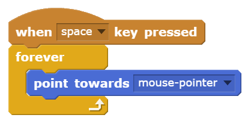
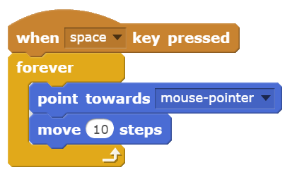
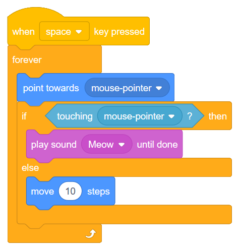

Repeat and If/Else
==================

.. sidebar:: Teacher Note - Overview of Day

    Use a **forever** block combined with an **if/else** block to make a character follow the mouse, then make a sound when it reaches the mouse cursor. Introduce the pen in Scratch, and use it to draw regular polygons with the **repeat** block.

If you'd prefer to watch a video describing how to create your first Scratch program, `the following video <https://www.youtube.com/watch?v=AJ1elMM7CwY>`_ demonstrates the same ideas as what I've described in text below.

.. youtube:: AJ1elMM7CwY
    :height: 315
    :width: 560
    :align: left
    :http: https

.. warning:: This is just a stub, to give a sense of what should go here. It will be written up properly soon...

Character Following the Mouse
-----------------------------

Let's make a program that has a cat following the mouse cursor around the stage, then meowing when it touches the mouse cursor. To start, hook up a **forever** block to a **when key is pressed** event block. Now put a **point towards mouse-pointer** block inside the forever block. Your program should look like this:

When you press the space key, you should see the cat continue to turn and face the direction of the mouse cursor. To make the cat move, connect a **move 10 steps** block as the last part of the forever block, as follows:

When you press the space key now, the cat should be following your mouse cursor around the screen. There is an obvious problem, however, when the cat actually *catches* the mouse. The cat overshoots the mouse, gets to the other side of it, turns around, then does the same thing all over again. Let's fix this situation by having the cat stop moving when it gets close to the mouse, and make a meowing sound instead.

We learned in the previous lesson that anytime you want to ask the computer a question, you can do it using an **if-then** block. Although we could use an **if-then** block to ask whether the cat is close to the mouse, in this situation we want to do one thing if the cat is far away, and a different thing when the cat is close. For situations like this, we can use a **if/else** block. The question we want to ask the computer is whether or not the cat is currently touching the mouse pointer. If it is, we want to have the cat make a meow sound. If it isn't, the cat should move closer to the mouse. To do this in Scratch, hook up an **if/else** block inside your forever block as follows:

Notice that when the cat touches the mouse cursor, 

Use a **forever** block combined with an **if/else** block to make a character follow the mouse, then make a sound when it reaches the mouse cursor.

Drawing Regular Polygons
------------------------

Introduce the pen in Scratch, and use it to draw regular polygons with the **repeat** block.

