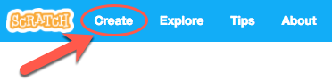
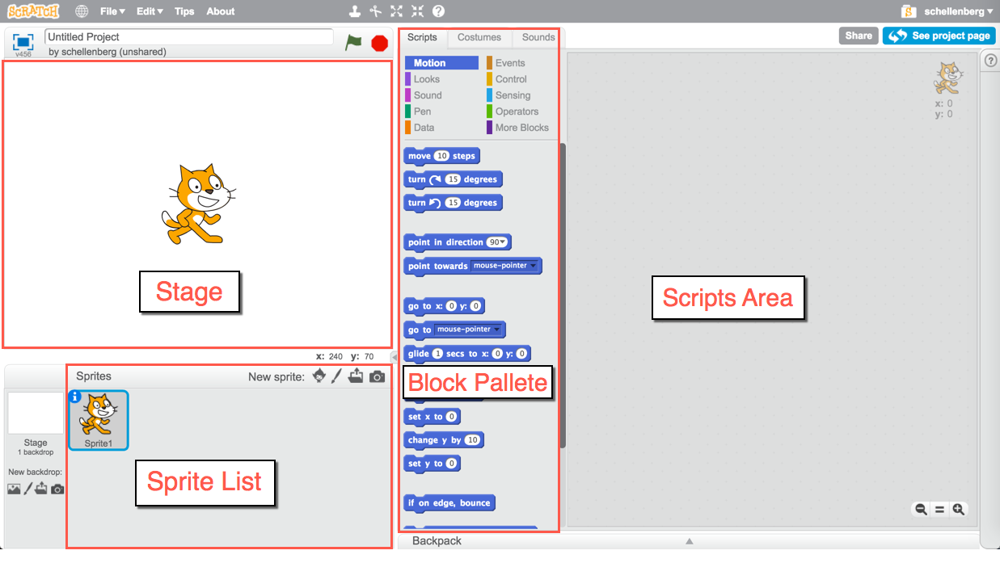
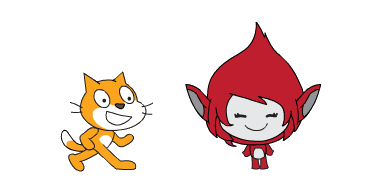
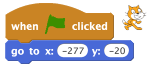
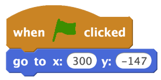
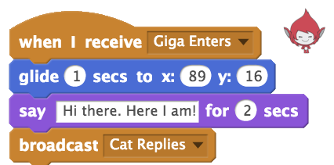
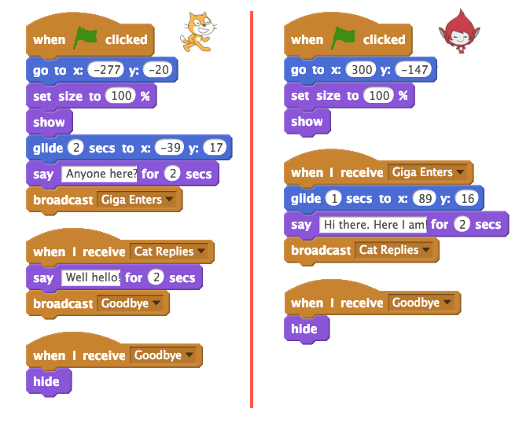

.. qnum::
   :prefix: scratch-intro
   :start: 1

Introduction to Scratch (Broadcasts)
============================================

.. topic:: Quick Overview of Day

    Introduction to the course, and to the Scratch environment. Explain the coordinate plane used in Scratch, and basic movement blocks. Introduce the idea of using the **broadcast** block to send messages, which is used to control program flow.

.. reveal:: curriculum_addressed_scratch_intro
    :showtitle: Curriculum Outcomes Addressed In This Section

    - **CS20-CP1** Apply various problem-solving strategies to solve programming problems throughout Computer Science 20.
    - **CS20-FP2** Investigate how control structures affect program flow.

Introduction
----------------------------

Welcome here! The goal of this course is to teach you how to problem solve, and we will be using the concepts of Computer Science to achieve that goal. By the end of the semester, you will be able to confidently solve problems by writing computer programs. In other words, you will be able to control what the computer does by writing algorithms (a series of steps).

Although we will eventually get to writing plain text into a file to create computer programs, that process can be a bit intimidating. To help you understand what you are able to teach a computer to do, we will follow the following process:

- use a visual programming environment (this will allow you to understand the basic control structures of computer science, and will prevent you from making any syntax errors that would cause your program to report an error when you run it)
- use a constrained language to solve algorithmic puzzles (here you will type in text to control what the computer is doing, which means you will run into syntax errors, but the puzzles you are solving will give you instant visual feedback)
- use a "traditional" computer science language (once you are feeling confident with many of the basic ideas of computer science, we will apply them using a traditional computer language)

Your First Computer Program!
----------------------------

There are many different visual programming environments, but the one we will use is called `Scratch <https://scratch.mit.edu/>`_. Your first task is to create an account on the Scratch website, so that the programs you write can be saved and accessed later. Go do that now!

If you'd prefer to watch a video describing how to create your first Scratch program, `the following video <https://www.youtube.com/watch?v=pJYCRtSDJSk>`_ demonstrates the same ideas as what I've described in text below.

.. youtube:: pJYCRtSDJSk
    :height: 315
    :width: 560
    :align: left
    :http: https

Now that you have an account, let's make your first computer program of the semester! Click the Create button on the top of the Scratch website to create a new project.

In the project view, the screen is divided into a number of panes, including the *stage* (where you will see your project run), *sprite list* (shows which sprites are part of your project, and allows you to select them), *block palette* (where all the blocks you can drag-and-drop onto your scripts), and the *scripts area* (where you will combine blocks of code to create programs for your sprites to run). One of the most important things for you to keep in mind is that **you can't break the environment**, so feel free to explore as much as you want!

.. sidebar:: Teacher Note

    You may want to spend some time exploring the environment with the students before you actually create the first program.

For our first program, let's create a simple conversation between two sprites. To do this, you'll need to add a second sprite to the project. You do this in a number of ways, each of which have an icon at the top of the sprite list pane. You can hover over each of the images with your mouse to discover what they represent. For now, use the "Choose Sprite from Library" icon to add an additional sprite to the stage.

.. image:: images/scratch_add_new_sprite_from_library.png

For this example, I included the Giga sprite, so my stage looks like this:

.. note:: Once you have more than one sprite in the sprite list pane, you will be able to see that the scripts area pane shows the script for the currently selected sprite. To be sure you understand this, drag a block from the block palette onto the scripts area. Now select a different sprite in the sprite list by clicking on it. Notice how the blocks in the scripts area change when you select a different sprite.

Now that you have two sprites in the sprite list pane, let's get them to have a simple conversation. Select the **Looks** tab in the block palette, then drag a **say "Hello" for 2 secs** block to the scripts area. A quick way to see the result of this block is by double clicking it. Try it now! *Note that the small image of the cat is intended to show which sprite is selected in the Sprite List when dragging the block from the Block Palette to the Scripts Area.*

.. image:: images/scratch_say_block.png

Of course, we don't want to have to double click the block to make the conversation happen, so we need to have an event trigger the say block. Select the **Events** tab in the block palette, then drag a **when flag clicked** block into the scripts area. Now, drag the **say "Hello" for 2 secs** block until it snaps onto the **when flag clicked** block. At this point, you should be able to make your sprite say Hello when you click the flag above the stage.

.. image:: images/scratch_blocks_connected.png

Before we move on with the conversation, we should know how to delete things. If you have a block in your Scripts Area that you no longer want, simply drag it back to the Block Palette and release the mouse.

.. image:: images/scratch_deleting_a_block.gif

To get our conversation going, drag one sprite to the left side of the stage, and the other to the right side of the stage. Now, let's set their starting locations. Hook up the character on the left side of the stage to a block, as follows:

The character on the right side of the stage should have the a script similar to this:

.. note::
  Notice that Scratch uses the Cartesian plane (the xy grid system you learned in math class), and that the origin is directly in the centre of the stage, as shown below:

  .. image:: images/scratch_coordinate_plane.png
     :align: center

Drag both sprites to the locations you would like them to be when they are going to have the conversation. Notice that the x and y values in the *Go to* block in the block palette updates with the x and y locations of the sprite when you release the mouse. Now hook a **glide 1 secs to x: y:** block to the bottom of the script of the character coming in from the left hand side of the stage. Then drag a **say Hello! for 2 secs** block from the Looks tab onto the bottom of that, to have the character start the conversation. Finally, drag a **broadcast** block from the Events tab and hook it onto the bottom of the script. It should now look something like this:

.. image:: images/scratch_goTo_andGlide.png

Broadcasts
----------

What is the point of that broadcast block that we added to the script? In this situation, we wanted the second sprite (the one entering from the right side of the screen) to do something **once an action performed by another sprite was completed**. Broadcasts let us send messages, and any sprite (including the sprite that sent the message) within our project can listen for that message, and respond accordingly. This time, what we'd like to have happen is for the second sprite to enter the screen after the first sprite has moved to the middle of the screen and said something.

.. note:: Broadcasts are a simple way to introduce the idea of the event-driven programming paradigm. Although much of this course will be using the procedural programming paradigm, it is really helpful to be understand the basic concept of responding to user events!

To have another sprite listen for a broadcast, click on the sprite that you would like to react to the broadcast, then drag a *when I receive* block from the **Events** tab of the block palette to the scripts area. We could have the character do anything we want, but for this example, let's make our characters have a simple conversation. Recreate the following, and click the Green flag.

We can hook up as many chained broadcasts as we like. For example, in the example shown below, both characters react to the flag being clicked by going to their starting locations. After that, the chain of events is controlled by the following broadcasts:

- Giga Enters
- Cat Replies
- Goodbye

Notice as well that any number of sprites can react to the same broadcast. In the above example, only one sprite reacts to the Giga Enters and Cat Replies broadcasts. For the Goodbye broadcast, however, both the Cat and Giga react by hiding.

Check Your Understanding
~~~~~~~~~~~~~~~~~~~~~~~~~

.. mchoice:: scratch_broadcast_check_1
   :answer_a: The current sprite would say "Go"
   :answer_b: The current sprite would say "Go", then say "Green!"
   :answer_c: The current sprite would say "Green!", then say "Go"
   :answer_d: The current sprite would say "Green!"
   :correct: b
   :feedback_a: Although this would happen, it is not the only thing! Consider what happens when the broadcast is sent.
   :feedback_b: Yes! The sprite would say "Go" for 1 second, then broadcast <em>first</em>, which it would respond to by saying "Green!" for 1 second.
   :feedback_c: No, it will say "Go" first (since that is the first thing in the chunk of code that executes when the flag is clicked).
   :feedback_d: It will do this, but it will say "Go" first (since that is the first thing in the chunk of code that executes when the flag is clicked).

   What would happen when you click the green flag, given the code below?

   .. image:: images/scratch_broadcast_check_1.png

.. mchoice:: scratch_broadcast_check_2
   :answer_a: The current sprite would say "Go" for 1 second, say "Green!" for 1 second, then move 10 steps.
   :answer_b: The current sprite would say "Go" for 1 second, move 10 steps, then say "Green!" for 1 second after the sprite stops moving.
   :answer_c: The current sprite would say "Go" for 1 second, then simultaneously move 10 steps and say "Green!" for 1 second.
   :correct: c
   :feedback_a: No, sending the broadcast will will cause the second chunk of blocks to execute, but will not stop the first chunk of code from continuing to execute. In other words, Scratch will not wait for the broadcast to be resolved before completing the rest of the chunk of code (in this case, the move 10 steps block).
   :feedback_b: No, both the say "Green" block and the move 10 steps block will happen simultaneously.
   :feedback_c: Yes, sending the broadcast will will cause the second chunk of blocks to execute, but will not stop the first chunk of code from continuing to execute.

   What would happen when you click the green flag, given the code below?

   .. image:: images/scratch_broadcast_check_2.png

.. mchoice:: scratch_broadcast_check_3
   :answer_a: The current sprite would say "Go" for 1 second, say "Green!" for 1 second, then move 10 steps.
   :answer_b: The current sprite would say "Go" for 1 second, move 10 steps, then say "Green!" for 1 second after the sprite stops moving.
   :answer_c: The current sprite would say "Go" for 1 second, then simultaneously move 10 steps and say "Green!" for 1 second.
   :correct: a
   :feedback_a: Yes! Since we are now using a broadcast and wait block, Scratch will pause the execution of the chunk of code that sent the broadcast until all scripts that reacted to the broadcast being sent have finished executing. 
   :feedback_b: No, the broadcast happens before the move, so the sprite will say "Green" before it moves.
   :feedback_c: No, since we are using a broadcast and wait block, the two scripts will not run simultaneously this time.

   What would happen when you click the green flag, given the code below?

   .. image:: images/scratch_broadcast_check_3.png

.. mchoice:: scratch_broadcast_check_4
   :answer_a: The current sprite would say "Hello" for 2 seconds, then glide to the position (-63, 18) during the next second.
   :answer_b: The current sprite would glide to the position (-63, 18) for the first second, then say "Hello" for next 2 seconds.
   :answer_c: The current sprite would say "Hello" for two seconds. During the first second (while it is saying hello), it will also glide to the position (-63, 18).
   :correct: c
   :feedback_a: No, since the broadcast happens before the sprite begins to say "Hello", both the say and the glide blocks will happen at the same time. 
   :feedback_b: No, since the broadcast happens before the sprite begins to say "Hello", both the say and the glide blocks will happen at the same time.
   :feedback_c: Yes! Since the broadcast happens before the sprite begins to say "Hello", both the say and the glide blocks will happen at the same time.

   What would happen when you click the green flag, given the code below?

   .. image:: images/scratch_broadcast_check_4.png

.. mchoice:: scratch_broadcast_check_5
   :answer_a: The current sprite would say "Hello" for 2 seconds, then glide to the position (-63, 18) during the next second.
   :answer_b: The current sprite would glide to the position (-63, 18) for the first second, then say "Hello" for next 2 seconds.
   :answer_c: The current sprite would say "Hello" for two seconds. During the first second (while it is saying hello), it will also glide to the position (-63, 18).
   :correct: b
   :feedback_a: No, since the broadcast block includes an "and wait", the "when I recieve" block needs to complete entirely before the flow of the program moves back to where the message was sent from. In this case, this means that the glide needs to finish entirely before the say block can execute. 
   :feedback_b: Yes! Since the broadcast block includes an "and wait", the "when I recieve" block needs to complete entirely before the flow of the program moves back to where the message was sent from. In this case, this means that the glide needs to finish entirely before the say block can execute.
   :feedback_c: No, since the broadcast block includes an "and wait", the "when I recieve" block needs to complete entirely before the flow of the program moves back to where the message was sent from. In this case, this means that the glide needs to finish entirely before the say block can execute.

   What would happen when you click the green flag, given the code below?

   .. image:: images/scratch_broadcast_check_5.png

Practice Problem
-----------------

Make a new Scratch project. Save it as ``Conversation``. Pick at least two sprites, and make them have a little conversation. Be sure to use **broadcasts** to control the flow of your program!

If you want a bit more of a challenge, explore the blocks palette and incorporate some other blocks that haven't been discussed yet!
