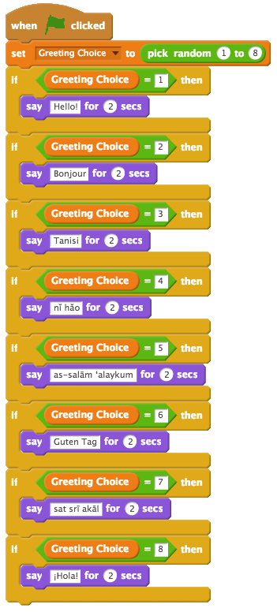
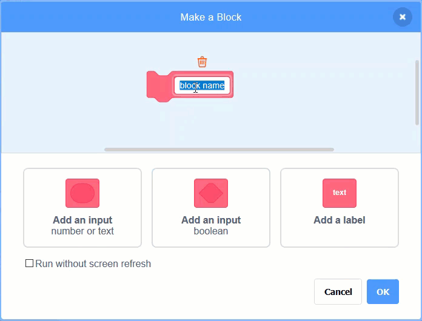
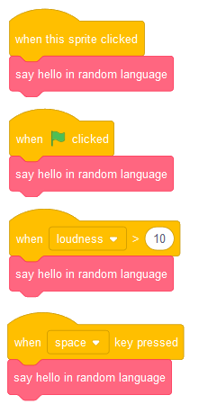
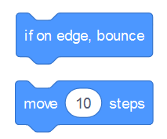
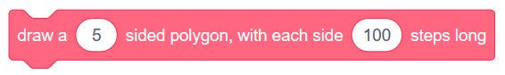
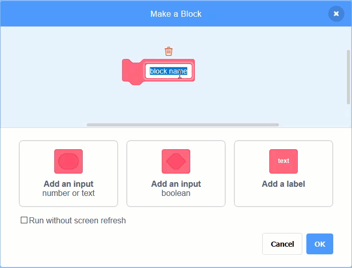
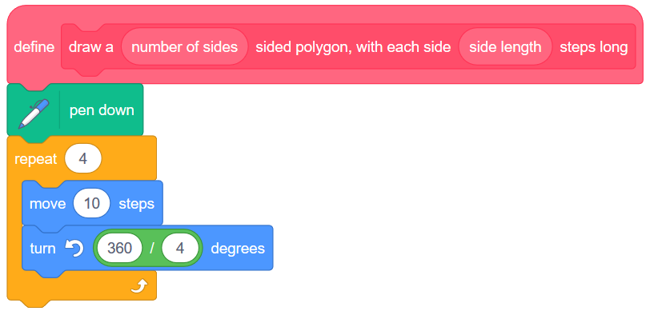
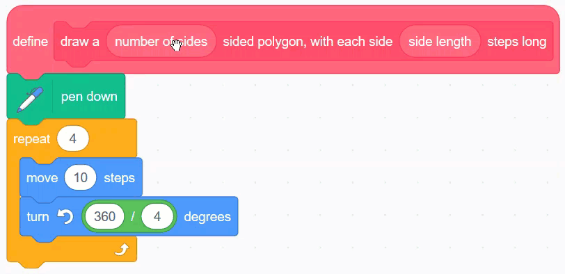

Making Your Own Blocks (Functions)
====================================

.. topic:: Quick Overview of Day

    Define your own blocks in Scratch. Create a block that says a random greeting (no argument required), then create a block that draws a polygon with a certain number of sides (argument required).

.. reveal:: curriculum_addressed
    :showtitle: Curriculum Outcomes Addressed In This Section

    - **CS20-CP1** Apply various problem-solving strategies to solve programming problems throughout Computer Science 20.
    - **CS20-FP1** Utilize different data types, including integer, floating point, Boolean and string, to solve programming problems.
    - **CS20-FP2** Investigate how control structures affect program flow.
    - **CS20-FP3** Construct and utilize functions to encapsulate reusable pieces of code.

If you'd prefer to watch a video, `the following video <https://www.youtube.com/watch?v=mXH0WTfA5eo>`_ demonstrates the same ideas I've described in text below.

.. youtube:: mXH0WTfA5eo
    :height: 315
    :width: 560
    :align: left
    :http: https

Say Greeting Block
------------------

At this point in our exploration of Scratch, we have learned how to use a large number of different blocks. What do we do, however, when we would like to have some functionality that isn't built into Scratch? As it turns out, we can create our own blocks, and use them just like the built in blocks! This is an incredibly powerful idea in Computer Science, and in most languages is called creating your own functions (we will explore how to do this in another language soon!).

Perhaps we would like to have a block that would say a greeting, choosing one at random from a number of different languages. For this example, we will have our block choose from one of the following greetings:

+--------+----------+-------------------+
| Number | Language |      Greeting     |
+========+==========+===================+
|      1 | English  | Hello             |
+--------+----------+-------------------+
|      2 | French   | Bonjour           |
+--------+----------+-------------------+
|      3 | Cree     | Tanisi            |
+--------+----------+-------------------+
|      4 | Chinese  | nǐ hǎo            |
+--------+----------+-------------------+
|      5 | Arabic   | as-salām 'alaykum |
+--------+----------+-------------------+
|      6 | German   | Guten Tag         |
+--------+----------+-------------------+
|      7 | Punjabi  | sat srī akāl      |
+--------+----------+-------------------+
|      8 | Spanish  | ¡Hola!            |
+--------+----------+-------------------+

There are 8 different greetings listed above. In order to choose between them, we need to have Scratch choose a random number from 1 to 8, then say one of the above greetings based on which number was chosen. If we wanted our sprite to say a random greeting when we press the flag, we could create the following:

What if we wanted to make our sprite say a random greeting in multiple situations? Perhaps we still want the sprite to say a greeting when the flag is clicked, but we also want it to say a greeting when it is clicked, when the space key is pressed, or when the noise level in the room with our computer gets particularly loud. Up until now, we would have to duplicate the code that we have just made, and attach it to multiple events. A better way is to create a new block, perhaps called "say hello in random language". To do this, select the More Blocks tab, then click Make a Block. In the empty block that now appears, type in the name you would like your new block to have:

You will now see a new event style block appear in your scripts area, called "define say hello in random language". You should drag the code that was previously attached to the "when flag clicked" block, and attach it to this new definition block. 

.. image:: images/scratch_greeting_multiple_languages.png

Once this new block has been defined, we can call it like any other built-in block. To do this, simply drag the block in from the More Blocks tab. We can now have our sprite say hello in a random language when many different events occur, without having to duplicate our code over and over.

Draw Polygon Block
------------------

If you inspect the built-in blocks available to us in Scratch, you will notice that there are two different types of blocks. 

For some blocks, such as the "if on edge, bounce" block, we do not provide any additional information to the block. With the "move 10 steps" block, however, we can control the behaviour of the block by changing the value of the **argument** to the block (originally set at 10). The greeting block we made above did not take in any arguments. Let's try creating a block that does take in arguments.

When we began to explore :ref:`scratch_variables`, we found a nice pattern to help us draw regular polygons. We want to use that pattern again, this time to create a block similar to the following:

In order to create a block that takes arguments, first select "Make a Block" from the More Blocks tab. Type in ``draw a``, then click Options, and select "Add number input". Label the number input ``number of sides``, then add label text ``sided polygon, with each side``. Add another number input called ``side length``, then finally label text ``steps long``.

Now that you have a block definition in your scripts area, recall the pattern that we used to draw regular polygon. If we only wanted to draw a square, our code would look like this:

We obviously do not want to have the block always draw a square. To allow the arguments that we pass to the block to be used, we simply drag them from the block definition into the code. For this code, drag the ``number of sides`` number input onto both the repeat block, as well as the turn block. Then drag the ``side length`` number input onto the move block.

Now that we have set up our drawing polygon block, you can use it like any other scratch block. For example, if you wanted to have a pentagon drawn when the user presses the space key, you would simply choose a 5 sided polygon, and pick a side length for the drawing.

.. image:: images/scrach_using_polygon_block.png

Practice Problem
-----------------

Work on your current Scratch assignment, for any remaining time.

.. note:: If your teacher did not assign you a project, you should explore the Scratch website to discover what types of projects are possible. Now try to create the most impressive project you can, making sure you demonstrate your understanding of the main topics shown so far (broadcasts, repetition, if/else, and variables).
