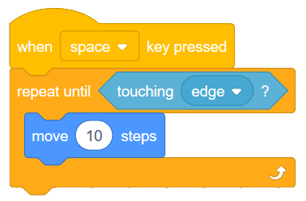
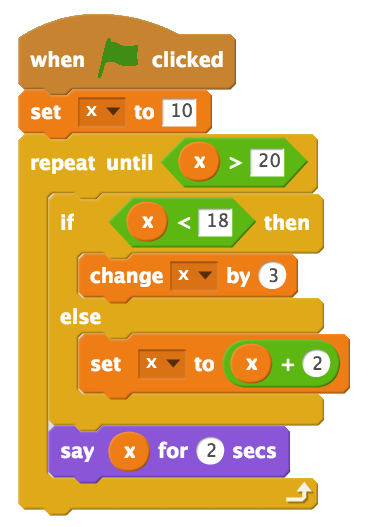
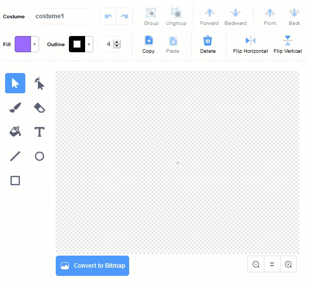
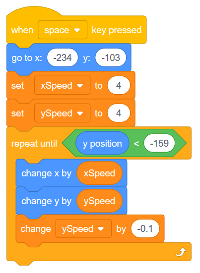

Tracing Code and Cannonball Motion (Repeat Until)
=================================================

.. topic:: Quick Overview of Day

    Introduce the **repeat until** block by tracing code with simple variables and conditionals. Use the repeat until block to simulate the motion of a cannon ball (motion repeats until the cannon ball hits the ground).

.. reveal:: curriculum_addressed
    :showtitle: Curriculum Outcomes Addressed In This Section

    - **CS20-CP1** Apply various problem-solving strategies to solve programming problems throughout Computer Science 20.
    - **CS20-FP1** Utilize different data types, including integer, floating point, Boolean and string, to solve programming problems.
    - **CS20-FP2** Investigate how control structures affect program flow.

If you'd prefer to watch a video, `the following video <https://www.youtube.com/watch?v=_jTHwZCY2CI>`_ demonstrates the same ideas as what I've described in text below.

.. youtube:: _jTHwZCY2CI
    :height: 315
    :width: 560
    :align: left
    :http: https

Repeat Until
-------------

Sometimes, we don't necessarily know ahead of time how many times we should repeat a block in our code. Perhaps we are shooting a virtual cannon, and we want the cannonball to continue moving until the ball hits the ground. Depending on the values of the forces we are applying to the cannonball (gravity, wind, friction, etc), the number of times that we should repeat the code containing the cannonball motion will change. In these situations, we want to use the **repeat until** block.

.. image:: images/scratch_empty_repeat_until.png

Any code that is put inside of the repeat until block will continue to happen until the condition is true. For example, we could make a character move forward 10 steps in whatever direction it is facing until it is touching the edge of the screen.

Tracing Repeat Until With Variables
------------------------------------

One way to make sure you understand how a repeat until block works is to try to *trace* code that contains a repeat until block. Tracing code means to try to read the code *in the same order that the computer will read the code*, which might mean repeating some portions of the code.

To practice this skill, consider the code shown below. If you decide to recreate the code below in Scratch, note that you will need to first click on the Data tab, then Make a Variable named *x*. 

.. note:: Teacher Note: Tracing the code with the students using a t-chart on a whiteboard is an excellent way to introduce the idea of tracing code. 

When we trace through the code shown above, it can be really helpful to use a t-chart to organize our thinking. 

+------------+------------+
| iterations | Value of x |
+============+============+
|          0 |            |
+------------+------------+
|          1 |            |
+------------+------------+
|          2 |            |
+------------+------------+
|          3 |            |
+------------+------------+
|          4 |            |
+------------+------------+
|          5 |            |
+------------+------------+

**Iterations** means the number of times that a repeat block has occurred. Now we need to step through the code, one line at time to make sure we understand what will happen at each step. After 0 iterations (in other words, before the repeat block has executed), the value of *x* is set to 10, so we fill that in on our t-chart.

+------------+------------+
| iterations | Value of x |
+============+============+
|          0 | **10**     |
+------------+------------+
|          1 |            |
+------------+------------+
|          2 |            |
+------------+------------+
|          3 |            |
+------------+------------+
|          4 |            |
+------------+------------+
|          5 |            |
+------------+------------+

Now we need to think through the first iteration of the loop. Before entering the loop, we need to confirm that the loop will in fact occur. Since our value of *x* is currently 10, we **do** enter the loop, since we must repeat until *x* is greater than 20. Inside the loop, we encounter an if statement that we need to resolve. Since 10 is less than 18, we execute the code inside the if statement (and *not* the code inside the else portion). Changing *x* by 3 simply adds 3 to the previous value of *x*, so we are now at a value of 13. The last block inside the repeat until loop is simply a say block, which will not affect the value of *x*, so we can fill in the next line of our chart.

+------------+------------+
| iterations | Value of x |
+============+============+
|          0 | 10         |
+------------+------------+
|          1 | **13**     |
+------------+------------+
|          2 |            |
+------------+------------+
|          3 |            |
+------------+------------+
|          4 |            |
+------------+------------+
|          5 |            |
+------------+------------+

The arrow on the bottom portion of the repeat until block indicates that the flow of code will return to the beginning of the repeat until block. We now need to confirm once again that the loop will occur again. Since 13 is not greater than 20, we do need to repeat again. 13 is less than 18, so we execute the code block inside the if statement again, which changes x by 3 to make *x* 16. Note that we will never execute both the code in the if portion and the else portion -- we can only ever execute one portion or the other, never both. 

+------------+------------+
| iterations | Value of x |
+============+============+
|          0 | 10         |
+------------+------------+
|          1 | 13         |
+------------+------------+
|          2 | **16**     |
+------------+------------+
|          3 |            |
+------------+------------+
|          4 |            |
+------------+------------+
|          5 |            |
+------------+------------+

The same process happens again. Since 16 is less than 20, the loop continues. Because 16 is less than 18, we change *x* by 3 to get a new value of 19.

+------------+------------+
| iterations | Value of x |
+============+============+
|          0 | 10         |
+------------+------------+
|          1 | 13         |
+------------+------------+
|          2 | 16         |
+------------+------------+
|          3 | **19**     |
+------------+------------+
|          4 |            |
+------------+------------+
|          5 |            |
+------------+------------+

Since 19 is less than 20, we enter the loop again. However, when we examine the if statement, since 19 is *not* less than 18, we execute the code inside the else block. We therefore need to set *x* to *x* + 2. This is just another way to say that we will change *x* by 2, so our new value for *x* is 21. You can read the block as "set *x* to be the previous value of *x* plus 2". 

+------------+------------+
| iterations | Value of x |
+============+============+
|          0 | 10         |
+------------+------------+
|          1 | 13         |
+------------+------------+
|          2 | 16         |
+------------+------------+
|          3 | 19         |
+------------+------------+
|          4 | **21**     |
+------------+------------+
|          5 |            |
+------------+------------+

Once again, before entering the loop, we need to check to see if the repeat until condition has been met. Since 21 is greater than 20, the repeat until condition has been met, so we do **not** enter the loop again. If we had another block hooked on to the bottom of the repeat until block, it would now execute. Since we do not, the program has come to an end.

Class Activity: Repeat Until
-----------------------------

Your teacher will give you a printed copy of the :download:`Practice with Repeat Until Practice handout <handouts/scratch_repeat_until_practice.pdf>`. 

Now that you have seen how to trace the the code contained in a repeat until block, take a few minutes to try to fill in the practice sheet linked to above. After you have completed each question, you may double check your work by recreating the question in Scratch.

.. note:: 
	**Teacher Note:** Instead of having students recreate the problems in Scratch to check their work, it can be very useful to trace the code together as a class. Writing down a t-chart on a whiteboard is a nice way to talk through problems like these ones.

	If you would like to edit the Repeat Until Practice handout, you can download the :download:`editable Word document <handouts/scratch_repeat_until_practice.docx>`.

Cannonball Motion Using Repeat Until
-------------------------------------

Let's use the repeat until block to create a simulation of a cannonball being shot. First, we need to make a cannonball. To do this, click on the paintbrush beside New sprite (under the stage):

.. image:: images/scratch_paint_new_sprite.png

The process of creating the cannonball sprite is shown in the short animation below. There are a few things you should be aware of:

- using "Convert to vector" before doing any drawing is very important! Do this every time to make sure the quality of your graphics is as high as possible. *Your teacher might decide to go into more depth about the difference between vector and bitmap graphics.*
- when drawing the circle, you can hold down the shift key to force the ellipse to remain circular.
- setting the costume center (the last thing done in the animation below) is absolutely necessary! If you neglect to do this, your cannonball will behave in very strange ways (since the calculations about the x and y coordinates of the sprite are based on the costume center point).

To create the cannonball simulation, we need some variables to represent the speed at which the cannonball is traveling. Click on the Data tab, and make two variables: **xSpeed** and **ySpeed**. Then create a script that looks like the following:

When the space key is pressed, the cannonball will be reset to it's original position (on the left hand side of the screen), and the *xSpeed* and *ySpeed* variables will both be set to 4. The repeat until block condition states that the repeat block should continue until the y position of the sprite is less than -159. *The y position block can be found at the bottom of the Motion tab.* In other words, whatever is inside the repeat block will continue until the cannonball hits the virtual ground level (which we have set to be -159). Finally, we change the x and y coordinates of the sprite by the xSpeed and ySpeed variables. The last block of code in the repeat until is how we simulate gravity. Every iteration of the repeat until loop causes the ySpeed variable to decrease in value. Because we start with a positive ySpeed, the cannonball moves upward when the space key is pressed. Over time, however, the amount that the cannonball is moving up decreases, and then eventually becomes negative (meaning that the ball begins to fall). This allows us to create a simple simulation of parabolic motion.

.. note:: Experiment by changing the initial values given for the xSpeed and ySpeed variables. You may also want to adjust the "gravity" value (initially set at -0.1).

Practice Problem
-----------------

Work on your second Scratch assignment, for any remaining time.

.. note:: If your teacher did not assign you a project, you may want to consider making a Rock Paper Scissors simulator to practice your Scratch skills. You will need to use variables, if-else blocks, and broadcasts. A nice extension to the basic version of this project is to allow the user to choose either a player versus computer game, or a computer versus computer game.
