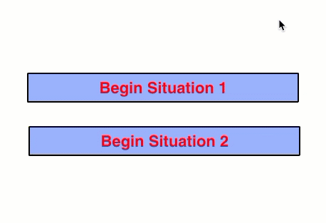
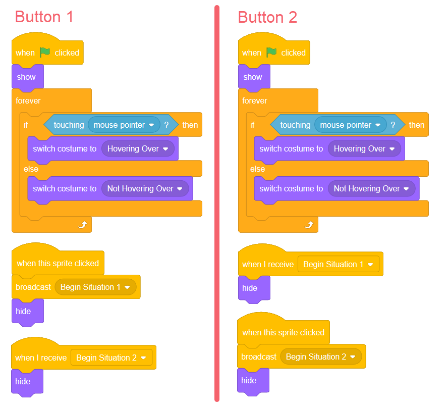
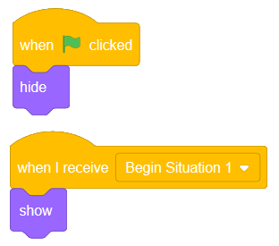

Making a Start Screen (Repeat, If/Else, Broadcast)
==================================================

.. topic:: Quick Overview of Day

    Use a combination of the **forever**, **broadcast**, and **if/else** blocks to make a simple start screen. Make multiple costumes for the button sprites to provide visual feedback when the user is hovering over the button.

.. reveal:: curriculum_addressed
    :showtitle: Curriculum Outcomes Addressed In This Section

    - **CS20-CP1** Apply various problem-solving strategies to solve programming problems throughout Computer Science 20.
    - **CS20-FP2** Investigate how control structures affect program flow.

If you'd prefer to watch a video, `the following video <https://www.youtube.com/watch?v=mrLWnxC07DU>`_ demonstrates the same ideas I've described in text below.

.. youtube:: mrLWnxC07DU
    :height: 315
    :width: 560
    :align: left
    :http: https

Overview
---------

In some programs, we would like to present the user with a choice about what they want to do. For example, many games have a start screen with buttons to start the game, configure options, see highscores, etc. We can accomplish this in Scratch using a combination of the **broadcast**, **forever** and **if/else** blocks. Although there aren't any new concepts presented in this section, it does how you can create something useful with the blocks we have seen so far.

Creating A Button Sprite
-------------------------

The first step in creating a start screen is to create buttons. To do this, we will once again paint a new sprite. Begin by clicking the "Paint New Sprite" button:

.. image:: images/scratch_paint_new_sprite.png

Follow the steps below to create your button sprite (if these instructions are not enough for you to understand the process, you should watch the video above):

- convert to vector mode
- select the rectangle tool, and draw a rectangle on the screen
- fill in rectangle with a color (paint bucket tool) -- even if you decide to have a white background, you *need* to do this step, or clicking inside the rectangle will not select it, since there will be a transparent background
- pick a contrasting color, which will be used for your font
- select the text tool, and add the button label (something like "Begin Situation 1")
- name the costume something descriptive (like "Not Hovering Over")
- right click the costume, and select Duplicate
- rename this second costume as "Hovering Over"
- select different colors for this second costume, and apply the new colors to the background and font using the paint bucket tool

Set Up Button to React to Mouse
----------------------------------

Now that you have a sprite painted, we want to make the sprite behave like an actual button. There are two parts to this: we want the sprite to react to the mouse hovering over the button, and we want to broadcast a message when the button is pressed. You can accomplish this by creating code similar to the following:

Be sure you create message names that are descriptive. Broadcasts are *much* easier to keep track of if they are properly named.

.. note:: You can save yourself some time by totally completing the first button, then right clicking on the button sprite in the sprite list, and selecting duplicate. This will copy all of the costumes and code associated with the sprite, which means there are just a few changes to make.

Add Characters to Situation
-----------------------------

You could use a start screen like this in any way you choose, but to complete this simple example, we will simply have different sprites appear on the screen when one button or the other is pressed.

Pick a sprite or two from the library, position them somewhere on the screen, and add the following code to them:

Pick another sprite or two from the library, position them somewhere on the screen, and apply the following code to them:

.. image:: images/scratch_start_screen_characters_2.png

You should now be able to click on the green flag to reset your start screen. Clicking each button should cause different sprites to appear on the screen. Of course, in your own projects, you can have anything happen when the button is pressed!

Practice Problem
------------------

Work on your second Scratch assignment, for any remaining time.

.. note:: If your teacher did not assign you a project, you may want to consider making a Rock Paper Scissors simulator to practice your Scratch skills. You will need to use variables, if-else blocks, and broadcasts. A nice extension to the basic version of this project is to allow the user to choose either a player versus computer game, or a computer versus computer game. You could use a start screen to allow the user to choose which type of game to play.
