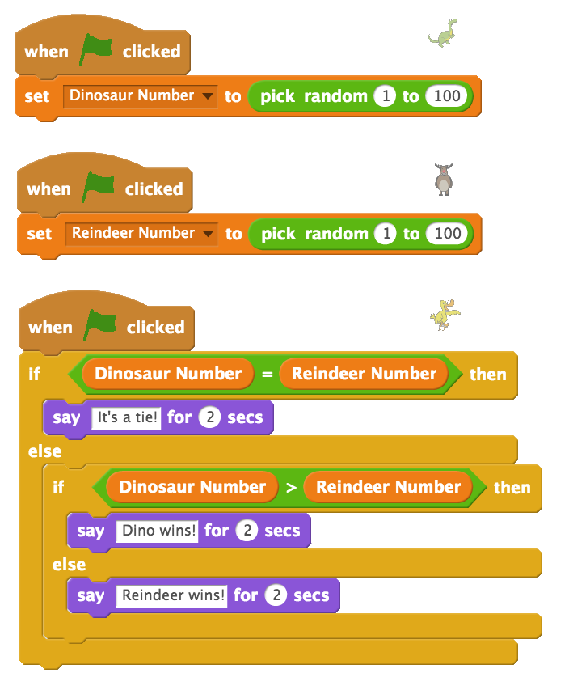
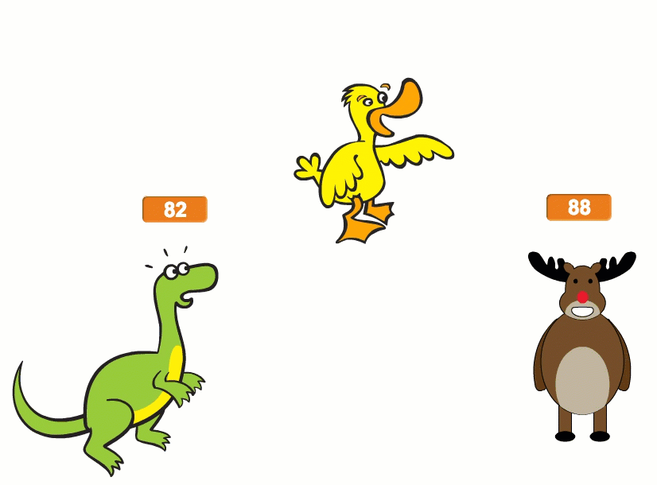
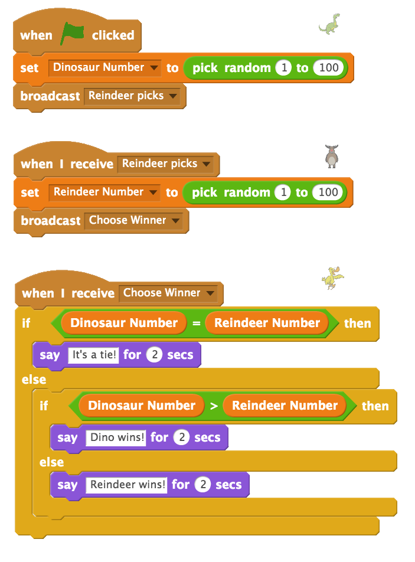
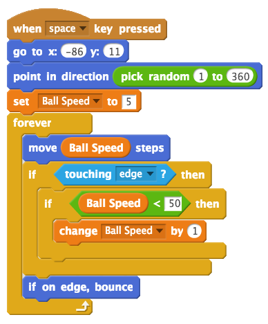
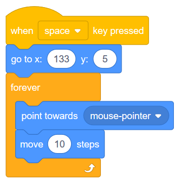
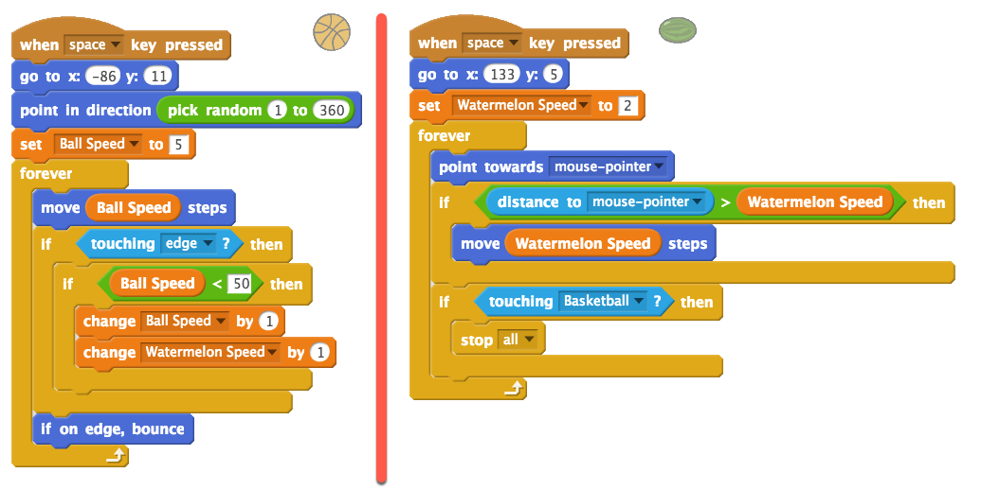

Timing Issues and Dodging Game (Broadcasts and Variables)
=========================================================

.. topic:: Quick Overview of Day

    Explore issues that arise when more than one script is triggered by the same event, and solve them by setting up ordered broadcasts. Create an object dodging game, using variables to allow both the object and character to increase in speed as the game progresses.

.. reveal:: curriculum_addressed
    :showtitle: Curriculum Outcomes Addressed In This Section

    - **CS20-CP1** Apply various problem-solving strategies to solve programming problems throughout Computer Science 20.
    - **CS20-CP2** Use common coding techniques to enhance code elegance and troubleshoot errors throughout Computer Science 20.
    - **CS20-FP2** Investigate how control structures affect program flow.

If you'd prefer to watch a video, `the following video <https://www.youtube.com/watch?v=1vPKlqxNloc>`_ demonstrates the same ideas I've described in text below.

.. youtube:: 1vPKlqxNloc
    :height: 315
    :width: 560
    :align: left
    :http: https

Timing Issues
-------------

When you begin creating more complicated projects in Scratch, it is possible to run into problems that we will call *timing issues*. This can happen when you respond to one event with multiple sprites. Although you can certainly respond to an event with many different sprites, there is no guarantee as to the order in which those responses will occur. If the response of one sprite depends on another sprite already taking an action, this can cause difficult to find problems in your project.

To demonstrate this problem, we will create a very simple "game" that intentionally exposes this problem. First, create three sprites and position them on the stage as follows:

.. image:: images/scratch_timing_issues_sprite_setup.png

For our game, we will the dinosaur and reindeer sprites each choose a random number from 1 to 100. The duck sprite will then determine which sprite is the winner (by checking which number is larger), and announce the winner. This would obviously be a terrible game to play with humans, but it will serve nicely to illustrate possible timing issues.

We need to create two variables, one to hold the number chosen by the dinosaur and one to hold the number chosen by the reindeer. Go to the Data tab to create these, making sure you provide descriptive names for the variables.

.. note:: 
	When creating your variables, you should leave the **For all sprites** button selected (instead of switching it to **For this sprite only**) unless you have a very good reason for declaring the variable only be accessible by the current sprite. If you create a variable for this sprite only, no other sprites are able to see what the value of that variable is (even if you drag the variable onto another sprite). You can tell that you have created a variable for a single sprite if, prior to the name of the variable, Scratch displays the name of the sprite followed by a colon:

	.. image:: images/scratch_variable_scope.png
	
Set up the basic version of the game by creating the following scripts for your sprites:

To make the variables a bit nicer to look at, you can right click on the variable (as shown on the stage), and select the "large readout" option. Now drag that variable so that it is over the appropriate sprite.

You should now test out your sketch by pressing the green flag a few times. You should notice that your program will occasionally select the correct winner, but will often make an error about who has won. Why is this happening? The logic of the duck sprite is correct, and yet we are encountering an error...

Although the individual logic of each of our sprites is correct, **they are all reacting to the same event** (in this case, the flag being clicked). We are therefore unable to guarantee the order the code will run. When the flag is clicked, we do not know whether the dinosaur, reindeer or duck will have their code executed first. If the duck code happens before both of the other sprites select their new numbers, the duck may be making a decision based on the numbers selected the last time the flag was clicked (or one old number and one new number). 

Since we need to guarantee the order in which these scripts run, we can remake the script so that dinosaur picks a number when the flag is clicked, then broadcasts a message telling the reindeer to pick a number. The reindeer can react to that message by picking a number, then broadcast a message telling the duck to determine the winner. With this setup, we are guaranteed to have both numbers chosen before the duck attempts to decide which sprite is the winner.

Dodging Game
------------

Let's try something totally different. This example will not require us to think about the timing issues that can crop up when we are responding to the same event with multiple sprites, but it will allow us to use quite a few of the ideas that we've learned so far. We will create a dodging game, in which there is a ball bouncing around the screen, and a second object that follows our mouse around the screen. As soon as the bouncing ball contacts the object following our mouse, the game will end.

To begin, select a ball to add to your project. I'm going with a basketball. Drag the ball to some location on the left side of the screen, so that we can avoid a collision right at the start of the game. We then need to choose a random direction that we should be moving, then forever move in that direction, and bounce if we hit the edge of the stage. Add the following script to your ball:

.. image:: images/scratch_dodging_game_bball_1.png

Although the version above does work, the game would always have the same difficulty level, since the ball is moving at a constant speed. To make the game more interesting, we'd like to have the ball start by moving relatively slowly, and speed up throughout the game. Whenever we need a value to change during our project, we should be thinking about adding a variable. Create a variable called Ball Speed (in the Data tab), then change the ball script to the following:

Note that in the script above, we have created a maximum value of 50 that the ball speed can increase up to. If we didn't have the 'if Ball Speed < 50' block, the ball would continue to increase speed throughout the game, and eventually be moving so fast that graphical problems would occur (since the ball would be moving by more steps/pixels than the screen contains).

Now we need to create a sprite that will follow our mouse around the screen while trying to dodge the bouncing ball. I'm going with a watermelon, but you can choose any sprite. Drag the watermelon somewhere on the right hand side of the stage to avoid a collision right at the start of the game. We now want the watermelon to always move in the direction of the mouse. Try adding a script like the following to your sprite, and test it out:

When you run the script given above, you can see that although the watermelon does follow the mouse, there are a few problems. One problem is that the watermelon moves at the same speed for the entire game. To solve this problem, we need to create another variable (something like "Watermelon Speed") that increases at the same rate as the bouncing ball. 

Another problem is that when the watermelon "catches" the mouse, it has incredibly jittery movement. This happens because the watermelon points toward the mouse, moves past the mouse, turns around and then does it all again. A nice way to solve this issue is to first ask if the distance to the mouse is greater than the speed the watermelon is moving, and only move toward the mouse if we won't overshoot the goal.

The final problem is that we have not actually checked to see if the the watermelon is touching the basketball. We need to add that question to the script, and stop everything that is happening when the two sprites touch.

To solve each of these problems, adapt your previous code as follows:

.. note:: An interesting extension to the dodging game is having the a sound play when the sprites collide. You may have to use a broadcast, and explore the 'stop other scripts in sprite' block to make it work.

Practice Problem
------------------

Work on your second Scratch assignment, for any remaining time.

.. note:: If your teacher did not assign you a project, you may want to consider making a Rock Paper Scissors simulator to practice your Scratch skills. You will need to use variables, if-else blocks, and broadcasts. A nice extension to the basic version of this project is to allow the user to choose either a player versus computer game, or a computer versus computer game. You could use a start screen to allow the user to choose which type of game to play.

